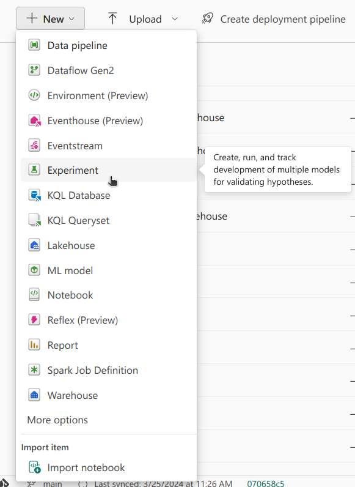

[//]: # "Mostly using active voice (we did...) instead of passive voice (x was done...) to sound more direct and engaging. Passive voice used when we want to give emphasis to the object (A Lakehouse was created - emphasis on the Lakehouse)"

## Introduction

At the time of writing, it's basketball season in the United States, and there is a lot of excitement around the men's and women's college basketball tournaments. The format is single elimination, so over the course of several rounds, teams are eliminated, till eventually we get a champion. This tournament is not only a showcase of upcoming basketball talent, but, more importantly, a fertile ground for data enthusiasts like us to analyze trends and predict outcomes.

One of the great things about sports is that there is lots of data available, and we at [Noble Dynamic](https://nobledynamic.com/) wanted to take a crack at it :nerd_face:.

In this series of posts titled *Fabric Madness*, we're going to be diving deep into some of the most interesting features of [Microsoft Fabric](https://www.microsoft.com/en-us/microsoft-fabric), for an end-to-end demonstration of how to train and use a machine learning model.

In this first blog post, we'll be going over:
- A frist look of the data using [Data Wrangler](https://learn.microsoft.com/en-us/fabric/data-science/data-wrangler).
- Exploratory Data Analysis (EDA) and Feature Engineering
- Tracking the performance of different Machine Learning (ML) Models using Experiments
- Selecting the best performing model using the ML Model functionality

Let's get to the first step, getting and processing data to create a dataset with relevant features.

## The Data

The data used was obtained from the on-going Kaggle competition, the details of which can be found [here](https://www.kaggle.com/competitions/march-machine-learning-mania-2024/overview).

Among all of the interesting data available, our focus for this case study was on the match-by-match statistics. This data was available for both the regular seasons and the tournaments, going all the way back to 2003. For each match, besides the date, the teams that were playing, and their scores, other relevant features were made available, such as field goals made and personal fouls by each team.

### Loading the Data

The first step was creating a Fabric **Workspace**. Workspaces in Fabric are one of the fundamental building blocks of the platform, and are used for grouping together related items and for collaboration.

After downloading all of the CSV files available, a **Lakehouse** was created. A Lakehouse, in simple terms, is a mix between a *Database* of Tables (structured) and a *Data Lake* of Files (unstructured). The big benefit of a Lakehouse is that data is available for every tool in the workspace.

Uploading the files was done using the UI:


Now that we have a Lakehouse with the CSV files, it was time to dig in, and get a first look at the data. To do that, we created a Notebook, using the UI, and attached the previously created lakehouse.


### First Look

After a quick data wrangling, it was found that, as expected with data from Kaggle, the quality was great. With no duplicates or missing values.

For this task we used [Data Wrangler](https://learn.microsoft.com/en-us/fabric/data-science/data-wrangler), a tool built into Microsoft Fabric notebooks. Once an initial DataFrame has been created (Spark or Pandas supported), Data Wrangler becomes available to use and can attach to any DataFrame in the Notebook. What's great is that it allows for easy analysis of loaded DataFrames.

In a Notebook, after reading the files into PySpark DataFrames, in the "Data" section, the "Transform DataFrame in Data Wrangler" was selected,  and from there the several DataFrames were explored. Specific DataFrames can be chosen, carrying out a careful inspection.


In the center, we have access to all of the rows of the loaded DataFrame. On the right, a **Summary** tab, showing that indeed there are no duplicates or missing values. Clicking in a certain column, summary statistics of that column will be shown.

On the left, in the **Operations** tab, there are several pre-built operations that can be applied to the DataFrame. The operations feature many of the most common data wrangling tasks, such as filtering, sorting, and grouping, and is a quick way to generate boilerplate code for these tasks.

In our case, the data was already in good shape, so we moved on to the EDA stage.

### Exploratory Data Analysis

A short Exploratory Data Analysis (EDA) followed, with the goal of getting a general idea of the data. Charts were plotted to get a sense of the distribution of the data and if there were any statistics that could be problematic due to, for example, very long tails.


At a quick glance, it was found that the data available from the regular season had normal distributions, suitable to use in the creation of features. Knowing the importance that good features have in creating solid predictive systems, the next sensible step was to carry out feature engineering to extract relevant information from the data.

The goal was to create a dataset where each sample's input would be a set of features for a game, containing information of both teams. For example, both teams average field goals made for the regular season. The target for each sample, the desired output, would be 1 if Team 1 won the game, or 0 if Team 2 won the game (which was done by subtracting the scores). Here's a representation of the dataset:

| Team1ID | Team2ID | Team1Feat1 | Team2Feat2 | T1Score-T2Score | Target |
|:-------:|:-------:|:----------:|:----------:|:---------------:|:------:|
| 1       | 2       | 0.5        | 0.6        | 8               | 1      |
| 3       | 1       | 0.2        | 0.7        | 12              | 1      |
| 2       | 4       | 0.8        | 0.6        | -3              | 0      |

### Feature Engineering

The first feature that we decided to explore was win rate. Not only would it be an interesting feature to explore, but it would also provide a baseline score. This initial approach employed a simple rule: the team with the higher win rate would be predicted as the winner. This method provides a fundamental baseline against which the performance of more sophisticated predictive systems can be compared to.

To evaluate the accuracy of our predictions across different models, we adopted the Brier score. The Brier score is the mean of the square of the difference between the predicted probability (p) and the actual outcome (o) for each sample, and can be described by the following formula:


\\(\Large Brier Score = \frac{1}{N} \sum_{i=1}^{N} (p_i - o_i)^2 \\)

The predicted probability will vary between 0 and 1, and the actual outcome will either be 0 or 1. Thus, the Brier score will always be between 0 and 1. As we want the predicted probability to be as close to the actual outcome as possible, the lower the Brier score, the better, with 0 being the perfect score, and 1 the worst.

For the baseline, the previously mentioned dataset structure was followed. Each sample of the dataset was a match, containing the win rates for the regular season for Team 1 and Team 2. The actual outcome was considered 1 if Team 1 won, or 0 if Team 2 won. To simulate a probability, the prediction was a normalised difference between T1's win rate and T2's win rate. For the maximum value of the difference between the win rates, the prediction would be 1. For the minimum value, the prediction would be 0.

```python
# Add the "outcome" column: 1 if T1_Score > T2_Score, else 0
tourney_df = tourney_df.withColumn("outcome", F.when(F.col("T1_Score") > F.col("T2_Score"), 1).otherwise(0))

# Adjust range from [-1, 1] to [0, 1]. If below .5 T1 loses, if above .5 T1 wins. If same win rate, assumed "draw" 
tourney_df = tourney_df.withColumn("probability", (F.col("T1_win_ratio") - F.col("T2_win_ratio") + 1) / 2)
```

After calculating the win rate, and then using it to predict the outcomes, we got a Brier score of **0.23**. Considering that guessing at random leads to a Brier score of **0.25**, it's clear that this feature alone is not very good 😬.

By starting with a simple baseline, it clearly highlighted that more complex patterns were at play. We went ahead to developed another 42 features, in preparation for utilising more complex algorithms, machine learning models, that might have a better chance.

It was then  time to create machine learning models!

## Models & Machine Learning Experiments

For the models, we opted for simple Neural Networks (NN). To determine which level of complexity would be best, we created three different NNs, with an increasing number of layers and hyper-parameters. Here's an example of a small NN, one that was used:

```python
from tensorflow.keras.models import Sequential
from tensorflow.keras.layers import Dense

def create_small_NN(input_shape):
    model = Sequential([
        Dense(64, activation='relu', input_shape=(number_of_features,)),
        Dense(1, activation='sigmoid')
    ])
    return model
```


If you're familiar with NNs, feel free to skip to the [Experiments](#what-is-an-experiment)! If you're unfamiliar with NNs think of them as a set of layers, where each layer acts as a filter for relevant information. Data passes through successive layers, in a step-by-step fashion, where each layer has inputs and outputs. Data moves through the network in one direction, from the first layer (the model's input) to the last layer (the model's output), without looping back, hence the **Sequential** function.

Each layer is made up of several neurons, that can be described as nodes. The model's input, the first layer, will contain as many neurons as there are features available, and each neuron will hold the value of a feature. The model's output, the last layer, in binary problems such as the one we're tackling, will only have 1 neuron. The value held by this neuron should be 1 if the model is processing a match where Team 1 won, or 0 if Team 2 won. The intermediate layers have an *ad hoc* number of neurons. In the example in the code snippet, 64 neurons were chosen. 

In a **Dense** layer, as is the case here, each neuron in the layer is connected to every neuron in the preceding layer. Fundamentally, each neuron **processes** the information provided by the neurons from the previous layer.

The processing of the previous layer's information requires an **activation function**. There are many types of activation functions - **ReLU**, standing for Rectified Linear Unit, is one of them. It allows only positive values to pass and sets negative values to zero, making it effective for many types of data.

Note that the final activation function is a **sigmoid** function - this converts the output to a number between 0 and 1. This is crucial for binary classification tasks, where you need the model to express its output as a probability.

Besides these small models, medium and large models were created, with an increasing number of layers and parameters. The size of a model affects its ability to capture complex patterns in the data, with larger models generally being more capable in this regard. However, larger models also require more data to learn effectively - if there's not enough data, issues may occur. Finding the right size is sometimes only possible through experimentation, by training different models and comparing their performance to identify the most effective configuration.

The next step was running the experiments :alembic:!

### What is an Experiment?

In Fabric, an Experiment can be seen as a group of related runs, where a run is an execution of a code snippet. In this context, a run is a training of a model. For each run, a model will be trained with a different set of hyper-parameters. The set of hyper-parameters, along with the final model score, is logged, and this information is available for each run. Once enough runs have been completed, the final model scores can be compared, so that the best version of each model can be selected.

Creating an Experiment in Fabric can be done via the UI or directly from a Notebook. The Experiment is essentially a wrapper for [MLFlow Experiments](https://mlflow.org/). One of great things about using Experiments in Fabric is that the results can be shared with others. The makes it possible to collaborate and allow others to participate in experiments, either writing code to run experiments, or analysing the results.

### Creating an Experiment

Using the UI, to create an Experiment simply select Experiment from the **+ New** button, and choose a name.



When training each of the models, the hyper-parameters are logged with the experiment, as well as the final score. Once completed we can see the results in the UI, and compare the different runs to see which model performed best.


After that we can select the best model and use it to make the final prediction. When comparing the three models, the best Brier score was **0.20**, a slight improvement :tada:!

## Conclusion

After loading and analysing data from this year's US major college basketball tournament, and creating a dataset with relevant features, we were able to predict the outcome of the games using a simple Neural Network. Experiments were used to compare the performance of different models. Finally, the best performing model was selected to carry out the final prediction.

In the next post we will go into detail on how we created the features using pyspark. Stay tuned for more! :wave:

**The full source code for this post can be found [here](https://dev.azure.com/nobledynamic/_git/FabricMadness).**