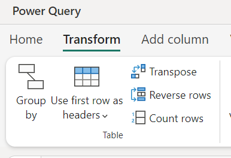
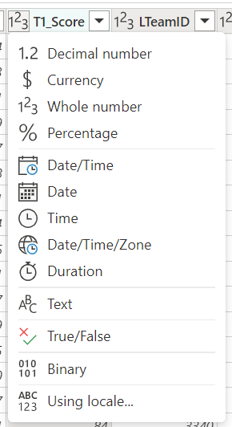
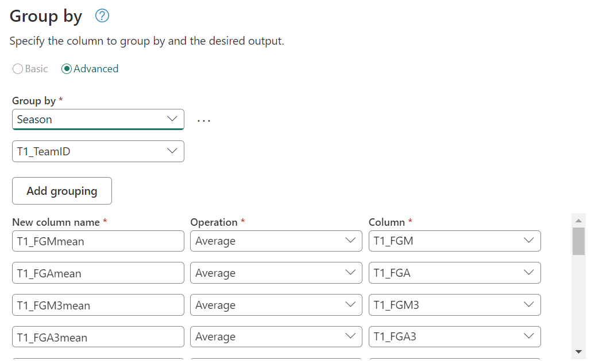

In the previous post, we discussed how to use Spark for feature engineering. In this post, we will discuss how we can instead use Dataflow Gen2 for a low code approach to feature engineering.

## What is Dataflow Gen2?

Dataflow Gen2 is a service that allows you to create data pipelines without writing any code. It is a low code solution that allows you to create data pipelines using a visual interface. It is a great tool for data engineers who are not familiar with coding or for those who want to quickly create data pipelines without writing any code.

## Loading the data
In this example, we will use the same dataset as in the previous post, which we've already loaded into our Lakehouse. 


From the list select OneLake data hub to find the Lakehouse and then once selected, find the csv file in the Files folder.


## Data preparation
Now that we have the data loaded, we can make a start on doing some light data preparation so that we can create our features. The first thing we need to do is set the column names to be set from the first row of the dataset. This can be done by selecting the "Use first row as headers" option in either the Transform group on the Home ribbon or in the Transform menu item.



Next we need to drop the columns that aren't needed and rename the rest to something more meaningful. This can be done by selecting the column and then typing the new name in the formula bar.

| Before        | After           |
| ------------- | -------------   |
| WLoc       | location  |
| W       | T1_  |
| L       | T2_  |

Season, DayNum, T1_TeamID, T1_Score, T2_TeamID, T2_Score


Finally, we need to change the data types of the column to something more appropriate. This can be done by selecting the column and then selecting the data type from the drop down list in the Transform group on the Home ribbon.



## First feature: Point difference
Our first feature will be to calculate the point difference between the two teams. In Power Query there are a few ways to do this, but the easiest is to select both the T1_Score and T2_Score columns and then select "Subtract" from the "Standard" group on the Add column ribbon.

```m
Table.AddColumn(#"Changed column type 1", "PointDiff", each [T1_Score] - [T2_Score], Int64.Type)
```

## Second features: Average points
Our second set of features will be based on the values from the regular season. We will calculate the average points scored by each team in the regular season. 

First the regular season games are loaded and point difference calculated. We will then calcuate the average (mean) of the T1 scores.

Select the Season and T1_TeamID columns and from the Transform menu, select Group by.

'T1_FGM', 'T1_FGA', 'T1_FGM3', 'T1_FGA3', 'T1_OR', 'T1_Ast', 'T1_TO', 'T1_Stl', 'T1_PF', 
            'T2_FGM', 'T2_FGA', 'T2_FGM3', 'T2_FGA3', 'T2_OR', 'T2_Ast', 'T2_TO', 'T2_Stl', 'T2_Blk',  
            'PointDiff'



This can be done by grouping the data by the TeamID and then calculating the average of the T1_Score and T2_Score columns.

Marge queries as new


## Conclusion
In this post, we discussed how to use Dataflow Gen2 for feature engineering. Dataflow Gen2 is a great tool for data engineers who are not familiar with coding or for those who want to quickly create data pipelines without writing any code. It is a low code solution that allows you to create data pipelines using a visual interface.