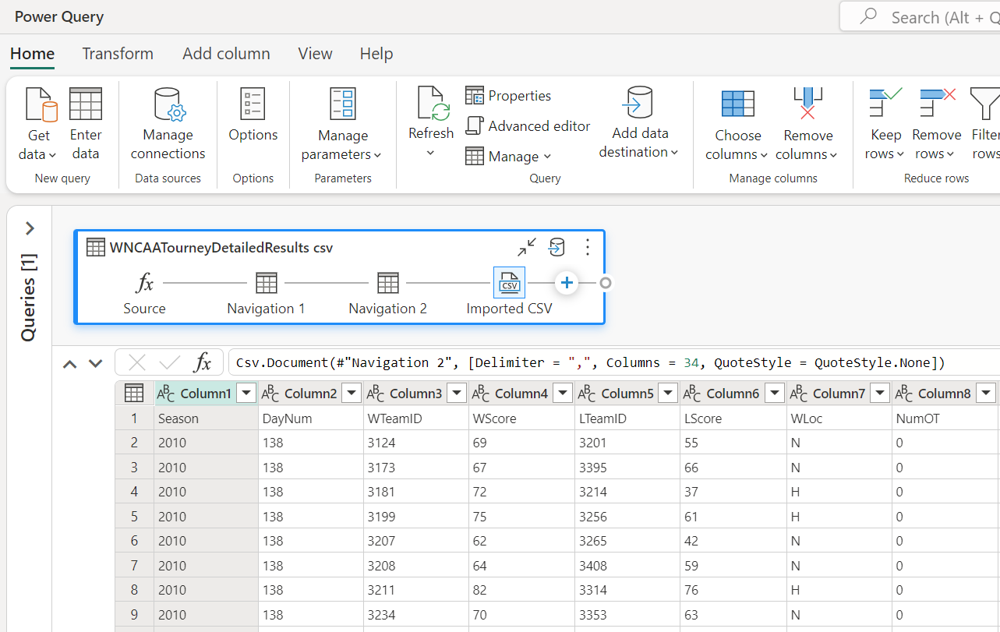

In the previous post, we discussed how to use Notebooks with pyspark for feature engineering. While spark offers a lot of flexibility and power, it can be quite complex and requires a lot of code to get started. Not everyone is comfortable with writing code or has the time to learn a new programming language, which is where Dataflow Gen2 comes in.

## What is Dataflow Gen2?

Dataflow Gen2 is a low code data transformation and integration engine that allows you to create data pipelines for loading data from a wide variety of sources into Microsoft Fabric. It's based on Power Query, which intergrated into many Microsoft products, such as Excel, Power BI, and Azure Data Factory. Dataflow Gen2 is a great tool for creating data pipelines wihtout code via a visual interface, making it easy to create data pipelines quickly. If you are already familiar with Power Query or are not afraid of writing code, you can also use the underlying M ("Mashup") language to create more complex transformations.
<<<<<<< HEAD

In this post, we will walk through how to use Dataflow Gen2 to create the same features needed to train our machine learning model. We will use the same dataset as in the previous post, which contains data about college basketball games.


## The Challenge
There are two datasets that we will be using to create our features: the regular season games and the tournament games. These two datasets are also split into the Men's and Women's tournaments, which will need to be combined into a single dataset. In total there are four csv files, that need to be combined and transformed into two separate tables in the Lakehouse.

Using Dataflows there are multiple ways to solve this problem, and in this post I want to show three different approaches: a no code approach, a low code approach and finally a more advanced all code approach.

## The no code approach
The first and simplest approach is to use the Dataflow Gen2 visual interface to load the data and create the features.

### Loading the data
The first step is to get the data from the Lakehouse, which can be done by selecting the "Get Data" button in the Home ribbon and then selecting **More...** from the list of data sources.


From the list, select **OneLake data hub** to find the Lakehouse and then once selected, find the csv file in the Files folder.


This will create a new query with four steps, which are:
* Source: A function that queries the Lakehouse for all the contents.
* Navigation 1: Converts the contents of the Lakehouse into a table.
* Navigation 2: Filters the table to retrieve the selected csv file by name.
* Imported CSV: Converts the binary file into a table.



Now that the data is loaded we can start with some basic data preparation to get it into a format that we can use to create our features. The first thing we need to do is set the column names to be based on the first row of the dataset. This can be done by selecting the "Use first row as headers" option in either the Transform group on the Home ribbon or in the Transform menu item.

The next step is to rename the column "WLoc" to "location" by either selecting the column in the table view, or by right clicking on the column and selecting "Rename". 

The location column contains the location of the game, which is either "H" for home, "A" for away, or "N" for neutral. For our purposes, we want to convert this to a numerical value, where "H" is 1, "A" is -1, and "N" is 0, as this will make it easier to use in our model. This can be done by selecting the column and then selecting using the **Replace values...** transform in the Transform menu item.


This will need to be done for the other two location values as well.

Finally, we need to change the data type of the location column to be a Whole number instead of Text. This can be done by selecting the column and then selecting the data type from the drop down list in the Transform group on the Home ribbon.


Instead of repeating the rename step for each of the location types, a little bit of M code can be used to replace the values in the location column. This can be done by selecting the previous transform in the query (Renamed columns) and then selecting the Insert step button in the formula bar. This will add a new step, and you can enter the following code to replace the values in the location column.

```m
Table.ReplaceValue(#"Renamed columns", each [location], each if Text.Contains([location], "H") then "1" else if Text.Contains([location], "A") then "-1" else "0", Replacer.ReplaceText, {"location"})
```
### Adding features
We've got the data loaded, but it's still not right for our model. Each row in the dataset represents a game between two teams, and includes the scores and statistics for both the winning and losing team in a single wide table. We need to create features that represent the performance of each team in the game and to have a row per team per game.

To do this we need to split the data into two tables, one for the winning team and one for the losing team. The simplest way to do this is to create a new query for each team and then merge them back together at the end. There are a few ways that this could be done, however to keep things simple and understandable (especially if we ever need to come back to this later), we will create two references to the source query and then append them together again, after doing some light transformations.

Referecing a column can be done either from the Queries panel on the left, or by selecting the context menu of the query if using Diagram view. This will create a new query that references the original query, and any changes made to the original query will be reflected in the new query. I did this twice, once for the winning team and once for the losing team and then renamed the columns by prefixing them with "T1_" and "T2_" respectively.


Once the column values are set, we can then combine the two queries back together by using Append Queries and then create our first feature, which is the point difference between the two teams. This can be done by selecting the T1_Score and T2_Score columns and then selecting "Subtract" from the "Standard" group on the Add column ribbon.

Now that's done, we can then load the data into the Lakehouse as a new table. The final result should look something like this:


There are a few limitations with the no code approach, the main one is that it's not easy to reuse queries or transformations. In the above example we would need to repeat the same steps another three times to load each of the individual csv files. This is where copy / paste comes in handy, but it's not ideal. Let's look at a low code approach next.

## The low code approach
In the low code approach we will use a combination of the visual interface and the M language to load and transform the data. This approach is more flexible than the no code approach, but still doesn't require a lot of code to be written.

### Loading the data
The goal of the low code approach is to reduce the number of repeated queries that are needed and to make it easier to reuse transformations. To do this we will take advantage of the fact that Power Query is a functional language and that we can create functions to encapsulate the transformations that we want to apply to the data. When we fist loaded the data from the Lakehouse there were four steps that were created, the second step was to convert the contents of the Lakehouse into a table, with each row containing a reference to a binary csv file. We can use this as the input into a function, which will load the csv into a new table, using the Invoke custom function transformation for each row of the table.


To create the function, select "Blank query" from the Get data menu, or right click the Queries panel and select "New query" > "Blank query". In the new query window, enter the following code:

```m
(TableContents as binary) =>let
  Source = Csv.Document(TableContents, [Delimiter = ",", Columns = 34, QuoteStyle = QuoteStyle.None]),
  PromoteHeaders = Table.PromoteHeaders(Source, [PromoteAllScalars = true])
in
  PromoteHeaders
```
The code of this function have been copied from our initial no code approach, but instead of loading the csv file directly, it takes a parameter called **TableContents**, reads it as a csv file `Csv.Document` and then sets the first row of the data to be the column headers `Table.PromoteHeaders`.

We can then use the Invoke custom function transformation to apply this function to each row of the Lakehouse query. This can be done by selecting the "Invoke custom function" transformation from the Add column ribbon and then selecting the function that we just created.


This will create a new column in the Lakehouse query, with the entire contents of the csv file loaded into a table, which is represented as `[Table]` in the table view. We can then use the expand function on the column heading to expand the table into individual columns.


The result effectively combines the two csv files into a single table, which we can then continue to create our features from as before.

There are still some limitations with this approach, while we've reduced the number of repeated queries, we still need to duplicate everything for both the regular season and tournament games datasets. This is where the all code approach comes in.

## The all code approach
The all code approach is the most flexible and powerful approach, but also requires the most amount of code to be written. This approach is best suited for those who are comfortable with writing code and want to have full control over the transformations that are applied to the data.

Essentially what we'll do is grab all the M code that was generated in each of the queries and combine them into a single query. This will allow us to load all the csv files in a single query and then apply the transformations to each of them in a single step. To get all the M code, we can select each query and the click on the Advanced Editor from the Home ribbon, which displays all the M code that was generated for that query. We can then copy and paste this code into a new query and then combine them all together.

To do this, we need to create a new blank query and then enter the following code:

```m
(TourneyType as text) => let
  Source = Lakehouse.Contents(null){[workspaceId = "..."]}[Data]{[lakehouseId = "..."]}[Data],
  #"Navigation 1" = Source{[Id = "Files", ItemKind = "Folder"]}[Data],
  #"Filtered rows" = Table.SelectRows(#"Navigation 1", each Text.Contains([Name], TourneyType)),
  #"Invoked custom function" = Table.AddColumn(#"Filtered rows", "Invoked custom function", each LoadCSV([Content])),
  #"Removed columns" = Table.RemoveColumns(#"Invoked custom function", {"Content", "Name", "Extension", "Date accessed", "Date modified", "Date created", "Attributes", "Folder Path", "ItemKind", "IsLeaf"}),
  #"Expanded Invoked custom function" = Table.ExpandTableColumn(#"Removed columns", "Invoked custom function", {"Season", "DayNum", "WTeamID", "WScore", "LTeamID", "LScore", "WLoc", "NumOT", "WFGM", "WFGA", "WFGM3", "WFGA3", "WFTM", "WFTA", "WOR", "WDR", "WAst", "WTO", "WStl", "WBlk", "WPF", "LFGM", "LFGA", "LFGM3", "LFGA3", "LFTM", "LFTA", "LOR", "LDR", "LAst", "LTO", "LStl", "LBlk", "LPF"}, {"Season", "DayNum", "WTeamID", "WScore", "LTeamID", "LScore", "WLoc", "NumOT", "WFGM", "WFGA", "WFGM3", "WFGA3", "WFTM", "WFTA", "WOR", "WDR", "WAst", "WTO", "WStl", "WBlk", "WPF", "LFGM", "LFGA", "LFGM3", "LFGA3", "LFTM", "LFTA", "LOR", "LDR", "LAst", "LTO", "LStl", "LBlk", "LPF"}),
  #"Renamed columns" = Table.RenameColumns(#"Expanded Invoked custom function", {{"WLoc", "location"}}),
  Custom = Table.ReplaceValue(#"Renamed columns", each [location], each if Text.Contains([location], "H") then "1" else if Text.Contains([location], "A") then "-1" else "0", Replacer.ReplaceText, {"location"}),
  #"Change Types" = Table.TransformColumnTypes(Custom, {{"Season", Int64.Type}, {"DayNum", Int64.Type}, {"WTeamID", Int64.Type}, {"WScore", Int64.Type}, {"LTeamID", Int64.Type}, {"LScore", Int64.Type}, {"location", Int64.Type}, {"NumOT", Int64.Type}, {"WFGM", Int64.Type}, {"WFGA", Int64.Type}, {"WFGM3", Int64.Type}, {"WFGA3", Int64.Type}, {"WFTM", Int64.Type}, {"WFTA", Int64.Type}, {"WOR", Int64.Type}, {"WDR", Int64.Type}, {"WAst", Int64.Type}, {"WTO", Int64.Type}, {"WStl", Int64.Type}, {"WBlk", Int64.Type}, {"WPF", Int64.Type}, {"LFGM", Int64.Type}, {"LFGA", Int64.Type}, {"LFGM3", Int64.Type}, {"LFGA3", Int64.Type}, {"LFTM", Int64.Type}, {"LFTA", Int64.Type}, {"LOR", Int64.Type}, {"LDR", Int64.Type}, {"LAst", Int64.Type}, {"LTO", Int64.Type}, {"LStl", Int64.Type}, {"LBlk", Int64.Type}, {"LPF", Int64.Type}}),
  Winners = Table.TransformColumnNames(#"Change Types", each if Text.StartsWith(_, "W") then Text.Replace(_, "W", "T1_") else Text.Replace(_, "L", "T2_")),
  #"Rename L" = Table.TransformColumnNames(#"Change Types", each if Text.StartsWith(_, "W") then Text.Replace(_, "W", "T2_") else Text.Replace(_, "L", "T1_")),
  #"Replaced Value L" = Table.ReplaceValue(#"Rename L", each [location], each if [location] = 1 then -1 else if Text.Contains([location], -1) then 1 else [location], Replacer.ReplaceValue, {"location"}),
  Losers = Table.TransformColumnTypes(#"Replaced Value L", {{"location", Int64.Type}}),
  Combined = Table.Combine({Winners, Losers}),
  PointDiff = Table.AddColumn(Combined, "PointDiff", each [T1_Score] - [T2_Score], Int64.Type)
in
  PointDiff
```
*Note: the Lakehouse connection values have been removed*

What's happening here is that we're loading the data from the Lakehouse, filtering the rows to only include the csv files that match the TourneyType parameter, loading the csv files into tables, expanding the tables into columns, renaming the columns, changing the data types, and then combining the two tables back together. Finally we calculate the point difference between the two teams.

Using the query is then as simple as selecting it, and then invoking the function with the TourneyType parameter.


This will create a new query with the function as it's source, and the data loaded and transformed. It's then just a case of loading the data into the Lakehouse as a new table.


As you can see, the LoadTournamentData function is invoked with the parameter "RegularSeasonDetailedResults" which will load both the Men's and Women's regular season games into a single table.
Dataflow Gen2 is a service that allows you to create data pipelines without writing any code. It is a low code solution that allows you to create data pipelines using a visual interface. It is a great tool for data engineers who are not familiar with coding or for those who want to quickly create data pipelines without writing any code.
=======
>>>>>>> 640e578 (Initial draft)

In this post, we will walk through how to use Dataflow Gen2 to create the same features needed to train our machine learning model. We will use the same dataset as in the previous post, which contains data about college basketball games.


## The Challenge
There are two datasets that we will be using to create our features: the regular season games and the tournament games. These two datasets are also split into the Men's and Women's tournaments, which will need to be combined into a single dataset. In total there are four csv files, that need to be combined and transformed into two separate tables in the Lakehouse.

Using Dataflows there are multiple ways to solve this problem, and in this post I want to show three different approaches: a no code approach, a low code approach and finally a more advanced all code approach.

## The no code approach
The first and simplest approach is to use the Dataflow Gen2 visual interface to load the data and create the features.

### Loading the data
The first step is to get the data from the Lakehouse, which can be done by selecting the "Get Data" button in the Home ribbon and then selecting **More...** from the list of data sources.


From the list, select **OneLake data hub** to find the Lakehouse and then once selected, find the csv file in the Files folder.


This will create a new query with four steps, which are:
* Source: A function that queries the Lakehouse for all the contents.
* Navigation 1: Converts the contents of the Lakehouse into a table.
* Navigation 2: Filters the table to retrieve the selected csv file by name.
* Imported CSV: Converts the binary file into a table.


Now that the data is loaded we can start with some basic data preparation to get it into a format that we can use to create our features. The first thing we need to do is set the column names to be based on the first row of the dataset. This can be done by selecting the "Use first row as headers" option in either the Transform group on the Home ribbon or in the Transform menu item.

The next step is to rename the column "WLoc" to "location" by either selecting the column in the table view, or by right clicking on the column and selecting "Rename". 

The location column contains the location of the game, which is either "H" for home, "A" for away, or "N" for neutral. For our purposes, we want to convert this to a numerical value, where "H" is 1, "A" is -1, and "N" is 0, as this will make it easier to use in our model. This can be done by selecting the column and then using the **Replace values...** transform in the Transform menu item.


This will need to be done for the other two location values as well.

Finally, we need to change the data type of the location column to be a Whole number instead of Text. This can be done by selecting the column and then selecting the data type from the drop down list in the Transform group on the Home ribbon.


Instead of repeating the rename step for each of the location types, a little bit of M code can be used to replace the values in the location column. This can be done by selecting the previous transform in the query (Renamed columns) and then selecting the Insert step button in the formula bar. This will add a new step, and you can enter the following code to replace the values in the location column.

```m
Table.ReplaceValue(#"Renamed columns", each [location], each if Text.Contains([location], "H") then "1" else if Text.Contains([location], "A") then "-1" else "0", Replacer.ReplaceText, {"location"})
```
### Adding features
We've got the data loaded, but it's still not right for our model. Each row in the dataset represents a game between two teams, and includes the scores and statistics for both the winning and losing team in a single wide table. We need to create features that represent the performance of each team in the game and to have a row per team per game.

To do this we need to split the data into two tables, one for the winning team and one for the losing team. The simplest way to do this is to create a new query for each team and then merge them back together at the end. There are a few ways that this could be done, however to keep things simple and understandable (especially if we ever need to come back to this later), we will create two references to the source query and then append them together again, after doing some light transformations.

Referecing a column can be done either from the Queries panel on the left, or by selecting the context menu of the query if using Diagram view. This will create a new query that references the original query, and any changes made to the original query will be reflected in the new query. I did this twice, once for the winning team and once for the losing team and then renamed the columns by prefixing them with "T1_" and "T2_" respectively.


Once the column values are set, we can then combine the two queries back together by using Append Queries and then create our first feature, which is the point difference between the two teams. This can be done by selecting the T1_Score and T2_Score columns and then selecting "Subtract" from the "Standard" group on the Add column ribbon.

Now that's done, we can then load the data into the Lakehouse as a new table. The final result should look something like this:


There are a few limitations with the no code approach, the main one is that it's not easy to reuse queries or transformations. In the above example we would need to repeat the same steps another three times to load each of the individual csv files. This is where copy / paste comes in handy, but it's not ideal. Let's look at a low code approach next.

## The low code approach
In the low code approach we will use a combination of the visual interface and the M language to load and transform the data. This approach is more flexible than the no code approach, but still doesn't require a lot of code to be written.

### Loading the data
The goal of the low code approach is to reduce the number of repeated queries that are needed and to make it easier to reuse transformations. To do this we will take advantage of the fact that Power Query is a functional language and that we can create functions to encapsulate the transformations that we want to apply to the data. When we first loaded the data from the Lakehouse there were four steps that were created, the second step was to convert the contents of the Lakehouse into a table, with each row containing a reference to a binary csv file. We can use this as the input into a function, which will load the csv into a new table, using the Invoke custom function transformation for each row of the table.


To create the function, select "Blank query" from the Get data menu, or right click the Queries panel and select "New query" > "Blank query". In the new query window, enter the following code:

```m
(TableContents as binary) =>let
  Source = Csv.Document(TableContents, [Delimiter = ",", Columns = 34, QuoteStyle = QuoteStyle.None]),
  PromoteHeaders = Table.PromoteHeaders(Source, [PromoteAllScalars = true])
in
  PromoteHeaders
```
The code of this function has been copied from our initial no code approach, but instead of loading the csv file directly, it takes a parameter called **TableContents**, reads it as a csv file `Csv.Document` and then sets the first row of the data to be the column headers `Table.PromoteHeaders`.

We can then use the Invoke custom function transformation to apply this function to each row of the Lakehouse query. This can be done by selecting the "Invoke custom function" transformation from the Add column ribbon and then selecting the function that we just created.


This will create a new column in the Lakehouse query, with the entire contents of the csv file loaded into a table, which is represented as `[Table]` in the table view. We can then use the expand function on the column heading to expand the table into individual columns.


The result effectively combines the two csv files into a single table, which we can then continue to create our features from as before.

There are still some limitations with this approach, while we've reduced the number of repeated queries, we still need to duplicate everything for both the regular season and tournament games datasets. This is where the all code approach comes in.

## The all code approach
The all code approach is the most flexible and powerful approach, but also requires the most amount of code to be written. This approach is best suited for those who are comfortable with writing code and want to have full control over the transformations that are applied to the data.

Essentially what we'll do is grab all the M code that was generated in each of the queries and combine them into a single query. This will allow us to load all the csv files in a single query and then apply the transformations to each of them in a single step. To get all the M code, we can select each query and then click on the Advanced Editor from the Home ribbon, which displays all the M code that was generated for that query. We can then copy and paste this code into a new query and then combine them all together.

To do this, we need to create a new blank query and then enter the following code:

```m
(TourneyType as text) => let
  Source = Lakehouse.Contents(null){[workspaceId = "..."]}[Data]{[lakehouseId = "..."]}[Data],
  #"Navigation 1" = Source{[Id = "Files", ItemKind = "Folder"]}[Data],
  #"Filtered rows" = Table.SelectRows(#"Navigation 1", each Text.Contains([Name], TourneyType)),
  #"Invoked custom function" = Table.AddColumn(#"Filtered rows", "Invoked custom function", each LoadCSV([Content])),
  #"Removed columns" = Table.RemoveColumns(#"Invoked custom function", {"Content", "Name", "Extension", "Date accessed", "Date modified", "Date created", "Attributes", "Folder Path", "ItemKind", "IsLeaf"}),
  #"Expanded Invoked custom function" = Table.ExpandTableColumn(#"Removed columns", "Invoked custom function", {"Season", "DayNum", "WTeamID", "WScore", "LTeamID", "LScore", "WLoc", "NumOT", "WFGM", "WFGA", "WFGM3", "WFGA3", "WFTM", "WFTA", "WOR", "WDR", "WAst", "WTO", "WStl", "WBlk", "WPF", "LFGM", "LFGA", "LFGM3", "LFGA3", "LFTM", "LFTA", "LOR", "LDR", "LAst", "LTO", "LStl", "LBlk", "LPF"}, {"Season", "DayNum", "WTeamID", "WScore", "LTeamID", "LScore", "WLoc", "NumOT", "WFGM", "WFGA", "WFGM3", "WFGA3", "WFTM", "WFTA", "WOR", "WDR", "WAst", "WTO", "WStl", "WBlk", "WPF", "LFGM", "LFGA", "LFGM3", "LFGA3", "LFTM", "LFTA", "LOR", "LDR", "LAst", "LTO", "LStl", "LBlk", "LPF"}),
  #"Renamed columns" = Table.RenameColumns(#"Expanded Invoked custom function", {{"WLoc", "location"}}),
  Custom = Table.ReplaceValue(#"Renamed columns", each [location], each if Text.Contains([location], "H") then "1" else if Text.Contains([location], "A") then "-1" else "0", Replacer.ReplaceText, {"location"}),
  #"Change Types" = Table.TransformColumnTypes(Custom, {{"Season", Int64.Type}, {"DayNum", Int64.Type}, {"WTeamID", Int64.Type}, {"WScore", Int64.Type}, {"LTeamID", Int64.Type}, {"LScore", Int64.Type}, {"location", Int64.Type}, {"NumOT", Int64.Type}, {"WFGM", Int64.Type}, {"WFGA", Int64.Type}, {"WFGM3", Int64.Type}, {"WFGA3", Int64.Type}, {"WFTM", Int64.Type}, {"WFTA", Int64.Type}, {"WOR", Int64.Type}, {"WDR", Int64.Type}, {"WAst", Int64.Type}, {"WTO", Int64.Type}, {"WStl", Int64.Type}, {"WBlk", Int64.Type}, {"WPF", Int64.Type}, {"LFGM", Int64.Type}, {"LFGA", Int64.Type}, {"LFGM3", Int64.Type}, {"LFGA3", Int64.Type}, {"LFTM", Int64.Type}, {"LFTA", Int64.Type}, {"LOR", Int64.Type}, {"LDR", Int64.Type}, {"LAst", Int64.Type}, {"LTO", Int64.Type}, {"LStl", Int64.Type}, {"LBlk", Int64.Type}, {"LPF", Int64.Type}}),
  Winners = Table.TransformColumnNames(#"Change Types", each if Text.StartsWith(_, "W") then Text.Replace(_, "W", "T1_") else Text.Replace(_, "L", "T2_")),
  #"Rename L" = Table.TransformColumnNames(#"Change Types", each if Text.StartsWith(_, "W") then Text.Replace(_, "W", "T2_") else Text.Replace(_, "L", "T1_")),
  #"Replaced Value L" = Table.ReplaceValue(#"Rename L", each [location], each if [location] = 1 then -1 else if Text.Contains([location], -1) then 1 else [location], Replacer.ReplaceValue, {"location"}),
  Losers = Table.TransformColumnTypes(#"Replaced Value L", {{"location", Int64.Type}}),
  Combined = Table.Combine({Winners, Losers}),
  PointDiff = Table.AddColumn(Combined, "PointDiff", each [T1_Score] - [T2_Score], Int64.Type)
in
  PointDiff
```
*Note: the Lakehouse connection values have been removed*

What's happening here is that we're:
1. Loading the data from the Lakehouse;
2. Filtering the rows to only include the csv files that match the TourneyType parameter;
3. Loading the csv files into tables;
4. Expanding the tables into columns;
5. Renaming the columns;
6. Changing the data types;
7. Combining the two tables back together;
8. Calculatint the point difference between the two teams.

Using the query is then as simple as selecting it, and then invoking the function with the TourneyType parameter.


This will create a new query with the function as it's source, and the data loaded and transformed. It's then just a case of loading the data into the Lakehouse as a new table.


As you can see, the LoadTournamentData function is invoked with the parameter "RegularSeasonDetailedResults" which will load both the Men's and Women's regular season games into a single table.

## Conclusion
And that's it!

Hopefully this post has given you a good overview of how to use Dataflow Gen2 to prepare data and create features for your machine learning model. Its low code approach makes it easy to create data pipelines quickly, and it contains a lot of powerful features that can be used to create complex transformations. It's a great first port of call for anyone who needs to transform data, but more importantly, has the benefit of not needing to write complex code that is prone to errors, is hard to test, and is difficult to maintain.

At the time of writing Dataflows Gen2 are unsupported with the Git integration, and so is not possible to version control or share the dataflows. This feature is expected to be [released in Q4 2024](https://learn.microsoft.com/en-us/fabric/release-plan/data-factory#git-df).
