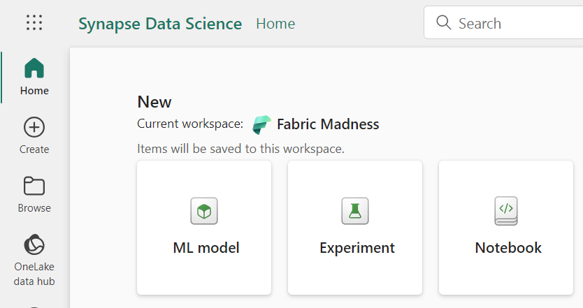
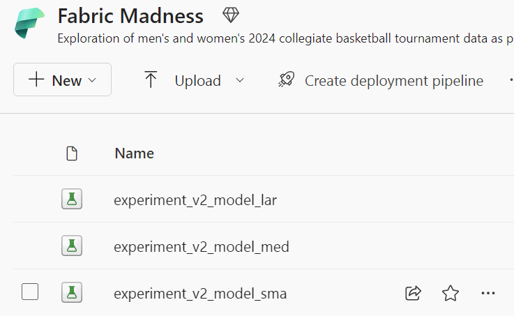
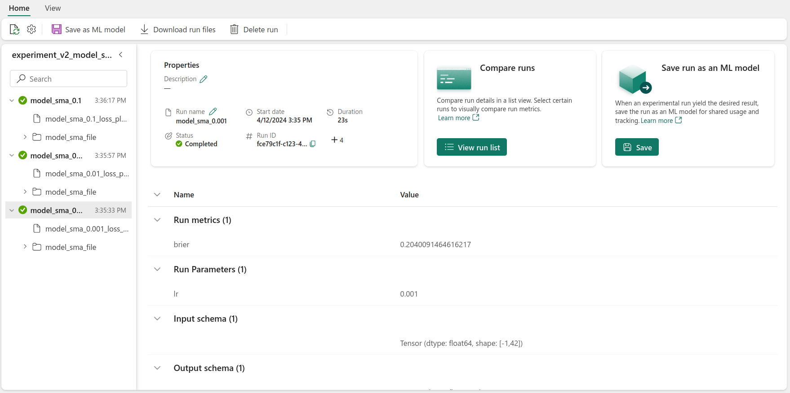
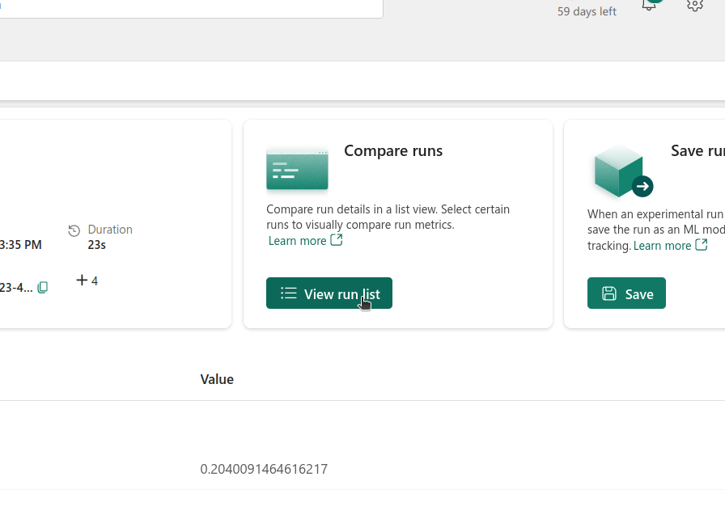
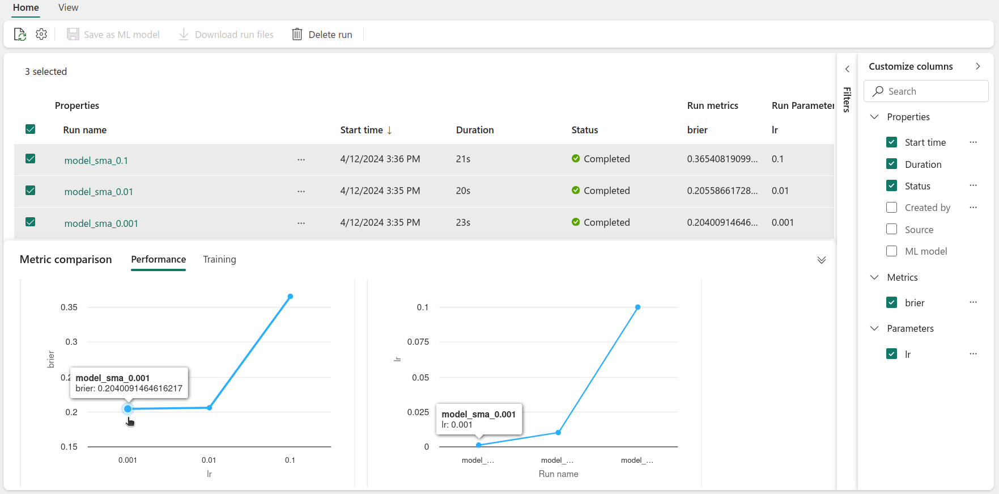
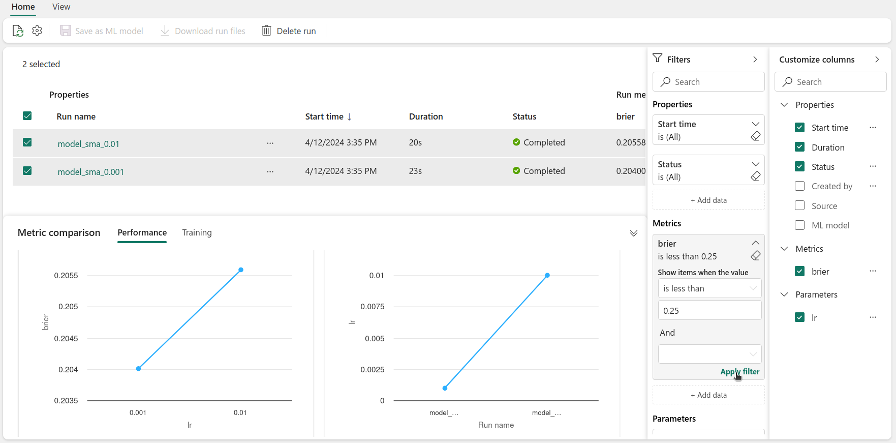

It's no secret that Machine Learning (ML) systems require careful tuning to become truly useful, it would be an extremely rare occurance for a model to work perfectly the first time it's run!

When first starting out on your ML journey, an easy trap to fall into is to try lots of different things to improve performance, but not recording these configurations along the way. This then makes it difficult to know which configuration (or combination of configurations) had the best performance.

When developing out models, there are lots of "knobs" and "levers" that can be adjusted, and often the best way to improve is to try different configurations and see which one works best. These things include the [improving features being used](/posts/fabric-madness-2/), trying differnt model architectures, adjusting the model's hyperparameters, and others. Experimentation needs to be systematic, and the results need to be logged. That's why having a good setup to carry out these experiments is fundamental in the development of any practical ML System, in the same way that source control is fundamental for code.

This is where *experiments* come in to play. Experiments are a way to keep track of these different configurations, and the results that come from them.

What's great about Experiments in Fabric is that they are actually a wrapper for [MLFlow](https://mlflow.org/), a hugely popular, open-source platform for managing the end-to-end machine learning lifecycle. This means that we can use all of the great features that MLFlow has to offer, but with the added benefit of not having to worry about setting up the infrastructure that a collaborative MLFlow environment would require. This allows us to focus on the fun stuff 😎!

In this post, we'll be going over how to use experiments in Fabric, and how to log and analyse the results of these experiments. Specifically, we'lll cover:
- How does MLFlow work?
- Creating and Setting Experiments
- Running Experiments and Logging Results
- Analysing Results

## How does MLFlow work?

At a high level, MLFlow is a platform that helps manage the end-to-end machine learning lifecycle. It's a tool that helps with tracking experiments, packaging code into reproducible runs, and sharing and deploying models. It's essentially a database that's dedicated to keeping  track of all the different configurations and results of the experiments that you run.

There are two main organisational structures in MLFlow - **experiments** and **runs**.

An experiment is a group of runs. Where a run is the execution of a block of code, a function or a script. This could be training a model, but it could also be used to track anything where things might change between runs. An experiment is then a way to group related runs.

For each run, information can be logged and attached to it - these could be metrics, hyperparameters, tags, artifacts (like plots, files or other useful outputs), and even models! By attaching models to runs, we can keep track of which model was used in which run, and how it performed. Think of it like source control for models, which is something we'll go into in the next post.

Runs can be filtered and compared. This allows us to understand which runs were more sucessful, and select the best performing run and use its setup (for example, in deployment).

Now that we've covered the basics of how MLFlow works, let's get into how we can use it in Fabric!

## Creating and Setting Experiments

Like everything in Fabric, creating items can be done in a few ways, either from the workspace **+ New** menu, using the Data Science experience or in code. In this case, we'll be using the Data Science experience.



Once that is done, to use that Experiment in a Notebook, we need to `import mlflow` and set up the experiment name:
```python
import mlflow

experiment_name = "[name of the experiment goes here]"

# Set the experiment
mlflow.set_experiment(experiment_name)
```

Alternatively, an Experiment can be created from code, which requires one extra command:
```python
import mlflow

experiment_name = "[name of the experiment goes here]"

# First create the experiment
mlflow.create_experiment(name=experiment_name)

# Then select it
mlflow.set_experiment(experiment_name)
```

Note that, if an Experiment with that name already exists, `create_experiment` will throw an error. We can avoid this by first checking for the existence of an Experiment, and only creating it if it doesn't exist:

```python
# Check if experiment exists
# if not, create it
if not mlflow.get_experiment_by_name(experiment_name):
    mlflow.create_experiment(name=experiment_name)
```

Now that we have the experiment set in the current context, we can start running code that will be saved to that experiment.

## Running Experiments and Logging Results

To start logging our results to an experiment, we need to start a run. This is done using the `start_run()` function and returns a `run` context manager. Here's an example of how to start a run:

```python

# Start the training job with `start_run()`
with mlflow.start_run(run_name="example_run") as run:
    # rest of the code goes here

```

Once the run is started, we can then begin logging metrics, parameters, and artifacts. Here's an example of code that would do that using a simple model and dataset, where we log the model's score and the hyperparameters used:


```python
# Set the hyperparameters
hyper_params = {"alpha": 0.5, "beta": 1.2}

# Start the training job with `start_run()`
with mlflow.start_run(run_name="simple_training") as run:
	# Create model and dataset
	model = create_model(hyper_params)
	X, y = create_dataset()
	
	# Train model
	model.fit(X, y)

	# Calculate score
	score = lr.score(X, y)

	# Log metrics and hyper-parameters
	print("Log metric.")
	mlflow.log_metric("score", score)

	print("Log params.")
	mlflow.log_param("alpha", hyper_params["alpha"])
	mlflow.log_param("beta", hyper_params["beta"])
		
```

In our example above, a simple model is trained, and its score is calculated. Note how metrics can be logged by using `mlflow.log_metric("metric_name", metric)` and hyperparameters can be logged using `mlflow.log_param("param_name", param)`.

### The Data
Let's now look at the code used for training our models, which are based on the outcome of basketball games. The data we are looking at is from the 2024 US college basketball tournaments, which was obtained from the March Machine Learning Mania 2024 Kaggle competition, the details of which can be found [here](https://medium.com/r/?url=https%3A%2F%2Fwww.kaggle.com%2Fcompetitions%2Fmarch-machine-learning-mania-2024%2Foverview), and is licensed under CC BY 4.0

In out setup, we wanted to try three different models, that used an increasing number of parameters. For each model, we also wanted to try three different learning rates (a hyperparameter that controls how much we are adjusting the weights of our network for each iteration). The goal was to find the best model and learning rate combination that would give us the best [Brier score](https://en.wikipedia.org/wiki/Brier_score) on the test set.

### The Models
To define the model architecture, we used tensorflow, creating three simple neural networks. Here are the functions that helped define the models.

```python
from tensorflow.keras.models import Sequential
from tensorflow.keras.layers import Dense

def create_model_small(input_shape):
    model = Sequential([
        Dense(64, activation='relu', input_shape=(input_shape,)),
        Dense(1, activation='sigmoid')
    ])
    return model

def create_model_medium(input_shape):
    model = Sequential([
        Dense(64, activation='relu', input_shape=(input_shape,)),
        Dense(64, activation='relu'),
        Dense(1, activation='sigmoid')
    ])
    return model

def create_model_large(input_shape):
    model = Sequential([
        Dense(128, activation='relu', input_shape=(input_shape,)),
        Dense(64, activation='relu'),
        Dense(64, activation='relu'),
        Dense(1, activation='sigmoid')
    ])
    return model
```

Creating our models in this way allows us to easily experiment with different architectures, and see how they perform. We can then use a dictionary to create a little *model factory*, that will allow us to easily create the models we want to experiment with.

We also, defined the input shape, which was the number of features that were available. We decided to train the models for 100 epochs, which should be enough for convergence 🤞.

```python
model_dict = {
    'model_sma': create_model_small,   # small
    'model_med': create_model_medium,  # medium
    'model_lar': create_model_large    # large
}

input_shape = X_train_scaled_df.shape[1]
epochs = 100
```

After this intial setup, it was time to iterate over the models' dictionary. For each model, an experiment was created. Note how we're using the code snippet from before, where we first check if the experiment exists, and only if it doesn't do we create it. Otherwise, we just set it.

```python
import mlflow

for model_name in model_dict:
    
    # create mlflow experiment
    experiment_name = "experiment_v2_" + model_name

    # Check if experiment exists
    # if not, create it
    if not mlflow.get_experiment_by_name(experiment_name):
        mlflow.create_experiment(name=experiment_name)

    # Set experiment
    mlflow.set_experiment(experiment_name)

    
```

Having set the experiment, we then performed three runs for each model, trying out different learning rates `[0.001, 0.01, 0.1]`.

```python
for model_name in model_dict:
	
	# Set the experiment
	...

	learning_rate_list = [0.001, 0.01, 0.1]

    for lr in learning_rate_list:
        
        # Create run name for better identification
        run_name = f"{model_name}_{lr}"
        with mlflow.start_run(run_name=run_name) as run:
			...
			# Train model
			# Save metrics
```

Then, in each run, we initialised a model, compiled it, and trained it. The compilation and training were done in a separate function, which we'll go into next. As we wanted to set the learning rate, we had to manually initialise the Adam optimizer. As our metric we used the Mean Squared Error (MSE) loss function, saving the model with the best validation loss, and logged the training and validation loss to ensure that the model was converging.

```python
def compile_and_train(model, X_train, y_train, X_val, y_val, epochs=100, learning_rate=0.001):
    # Instantiate the Adam optimizer with the desired learning rate
    optimizer = Adam(learning_rate=learning_rate)

    model.compile(optimizer=optimizer, loss='mean_squared_error', metrics=['mean_squared_error'])
    
    # Checkpoint to save the best model according to validation loss
    checkpoint_cb = ModelCheckpoint("best_model.h5", save_best_only=True, monitor='val_loss')
    
    history = model.fit(X_train, y_train, validation_data=(X_val, y_val),
                        epochs=epochs, callbacks=[checkpoint_cb], verbose=1)
    
    # Load and return the best model saved during training
    best_model = load_model("best_model.h5")
    return history, best_model
```

Having initialised a model, compiled and trained it, the next step was logging the training and validation losses, calculating the brier score for the test set, then logging the score and the learning rate used. Typically we would also log the training and validation loss using the `step` argument in `log_metric`, like so:

```python
# Log training and validation losses
for epoch in range(epochs):
	train_loss = history.history['loss'][epoch]
	val_loss = history.history['val_loss'][epoch]
	mlflow.log_metric("train_loss", train_loss, step=epoch)
	mlflow.log_metric("val_loss", val_loss, step=epoch)
```

However, we opted to create the training and validation loss plot ourselves using `matplotlib` and log that as an artifact.

Here's the plot function:

```python
import matplotlib.pyplot as plt

def create_and_save_plot(train_loss, val_loss, model_name, lr):
    epochs = range(1, len(train_loss) + 1)

    # Creating the plot
    plt.figure(figsize=(10, 6))
    plt.plot(epochs, train_loss, 'b', label='Training loss')
    plt.plot(epochs, val_loss, 'r', label='Validation loss')
    plt.title('Training and Validation Loss')
    plt.xlabel('Epochs')
    plt.ylabel('Loss')
    plt.legend()
    plt.grid(True)

    plt.title(f"Training and Validation Loss (M: {model_name}, LR: {lr})")

    # Save plot to a file
    plot_path = f"{model_name}_{lr}_loss_plot.png"
    plt.savefig(plot_path)
    plt.close()

    return plot_path
```

Putting everything together, here's what the code for that looks like:

```python

with mlflow.start_run(run_name=run_name) as run:
	# Create model and dataset
	model = model_dict[model_name](input_shape)

	# Train model
	history, best_model = compile_and_train(model,
											X_train_scaled_df, y_train,
											X_validation_scaled_df, y_validation,
											epochs,
											lr)
	
	# Log training and validation loss plot as an artifact
	train_loss = history.history['loss']
	val_loss = history.history['val_loss']

	plot_path = create_and_save_plot(train_loss, val_loss, model_name, lr)
	mlflow.log_artifact(plot_path)

	# Calculate score
	brier_score = evaluate_model(best_model, X_test_scaled_df, y_test)

	# Log metrics and hyper-parameters
	mlflow.log_metric("brier", brier_score)

	# Log hyper-param
	mlflow.log_param("lr", lr)

	# Log model
	...

```

For each run we also logged the model, which will be useful later on.

The experiments were ran, creating an experiment for each model, and three different runs for each experiment with each of the learning rates.


## Analysing Results

Now that we've run some experiments, it's time to analyse the results! To do this, we can go back to the workspace, where we'll find our newly created experiments with several runs.



Clicking in one experiment, here's what we'll see:



On the left we'll find all of the runs related to that experiment. In this case, we're looking at the small model experiment. For each run, there's two artifacts, the validation loss plot and the trained model. There's also information about the run's properties - its status and duration, as well as the metrics and hyper-parameters logged.

By clicking on the **View run list**, under the **Compare runs** section, we can compare the different runs.



Inside the run list view, we can select the runs that we wish to compare. In the **metric comparison** tab, we can find plots that show the Brier score against the learning rate. In our case, it looks like the lower the learning rate, the better the score. We could even go further and create more plots for the different metrics against other hyperparameters (if different metrics and hyperparameters had been logged).



Perhaps we would like to filter the runs - that can be done using **Filters**. For example we can select the runs that have a Brier score lower than 0.25. You can create filters based on logged metrics and parameters and the runs' properties.



By doing this, we can visually compare the different runs and assess which configuration led to the best performance. This can also be done using code - this is something that will be further explored in the next post.

Using the Experiment UI, we are then able to visually explore the different experiments and runs, comparing and filtering them as needed, to understand which configuration works best.

## Conclusion

And that wraps up our exploration of Experiments in Fabric!

Not only did we cover how to create and set up experiments, but we also went through how to run experiments and log the results. We also showed how to analyse the results, using the Experiment UI to compare and filter runs.

In the next post, we'll be looking at how to select the best model, and how to deploy it. Stay tuned!
