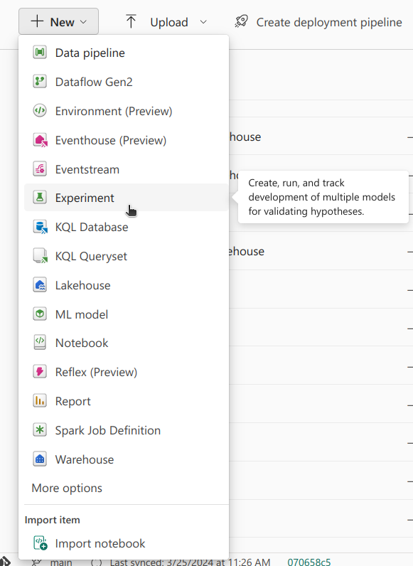

## Introduction

Machine Learning (ML) Systems usually require careful tuning of its parts. Be it, for example, the features being used, the model, the model's hyperparameters, or others. Often, improving the performance of a system is done in an **experimental** way, trying out different configurations, and seeing which one works best! 

When starting out on your ML journey an easy trap to fall into is not recording these configurations, making it difficult to know which configuration had the best performance. Experimentation needs to be systematic, and the results need to be logged. That's why having a good setup to carry out these experiments is fundamental in the development of ML Systems in the same way that source control is fundamental for code.

Throughout this series, we've been discussing how Fabric has an **Experiment** tool. This tool is essentially a wrapper for [MLFlow](https://mlflow.org/), with the added benefit of allowing for easy collaboration between anyone in the workspace. This has the benefit of us not having to worry about taking care of the infrastructure that a collaborative MLFlow environment would require, so we can instead focus on the fun stuff 😎! MLFlow is itself a great open-source platform - creating, running, analysing results, and drawing conclusions is made easy.

In this post, we aim to demonstrate how MLFlow is used within Fabric. We'll be going over:
- How does MLFlow work?
- Creating and Setting Experiments
- Running Experiments and Logging Results
- Analysing Results

## How does MLFlow work?

MLFlow can be seen, in a very simplified way, as a database and a set of utility functions to interact with that database. This is where the information about the experiments will be neatly stored. In Fabric, the underlying part of MLFlow is taken care of.

There are two main organisational structures in MLFlow - **experiments** and **runs**. An experiment is a group of runs. A run, put simply, is an execution of a code snippet. Often, this code snippet is when we train a model, but it can also be used to track anything where things might change between runs. An experiment is then a way to group related runs.

For each run, information can be logged and attached to it - this could be metrics, hyperparameters, tags, artifacts (sort of like files, useful for special plots saved as images), and even models! By attaching models to runs, we can keep track of which model was used in which run, and how it performed, which can be seen as source control for models. This is something that we'll go deeper into in the next post.

Runs can be filtered and compared. This allows us to understand which runs were more sucessful, and select the best performing run and use its setup (for example, in deployment).
Keep in mind, in Fabric, it seems that runs from different experiments can't be compared.

Knowing this, it's time to get practical!

## Creating and Setting Experiments

As mentioned in the first post of this series, using the UI to create an Experiment is straightforward - we have to select Experiment from the **+ New** button, and choose a name.



Once that is done, to use that Experiment in a Notebook, we need to `import mlflow` and set up the experiment name:
```python
import mlflow

experiment_name = "[name of the experiment goes here]"

# Set the experiment
mlflow.set_experiment(experiment_name)
```

Alternatively, an Experiment can be created from a Notebook, which requires one extra command:
Alternatively, an Experiment can be created from a Notebook, which requires one extra command:
```python
import mlflow

experiment_name = "[name of the experiment goes here]"

# First create the experiment
mlflow.create_experiment(name=experiment_name)

# Then select it
mlflow.set_experiment(experiment_name)
```

Note that, if an Experiment with that name already exists, `create_experiment` will throw an error. In that case you might want to use the following code snippet, where first the existence of an Experiment with a given name is checked, and only if it doesn't exist is it created.
Note that, if an Experiment with that name already exists, `create_experiment` will throw an error. In that case you might want to use the following code snippet, where first the existence of an Experiment with a given name is checked, and only if it doesn't exist is it created.

```python
import mlflow

experiment_name = "[name of the experiment goes here]"

# Check if experiment exists
# if not, create it
if not mlflow.get_experiment_by_name(experiment_name):
    mlflow.create_experiment(name=experiment_name)

# Set experiment
mlflow.set_experiment(experiment_name)
```

When we set the experiment, runs will be saved to that experiment.

## Running Experiments and Logging Results

To signal a run that ought to be saved to the experiment we can use the following code snippet in a Notebook cell:

```python

# Start the training job with `start_run()`
with mlflow.start_run(run_name="example_run") as run:
    # rest of the code goes here

```

An example of a general workflow is one where a model is trained, and its score and hyper-parameters are logged. Here's an example of code that would do that:

When we set the experiment, runs will be saved to that experiment.

## Running Experiments and Logging Results

To signal a run that ought to be saved to the experiment we can use the following code snippet in a Notebook cell:

```python

# Start the training job with `start_run()`
with mlflow.start_run(run_name="example_run") as run:
    # rest of the code goes here

```

An example of a general workflow is one where a model is trained, and its score and hyper-parameters are logged. Here's an example of code that would do that:


```python
# Set the hyperparameters
hyper_params = {"alpha": 0.5, "beta": 1.2}

# Start the training job with `start_run()`
with mlflow.start_run(run_name="simple_training") as run:
with mlflow.start_run(run_name="simple_training") as run:
	# Create model and dataset
	model = create_model(hyper_params)
	X, y = create_dataset()
	
	# Train model
	model.fit(X, y)

	# Calculate score
	score = lr.score(X, y)

	# Log metrics and hyper-parameters
	print("Log metric.")
	mlflow.log_metric("score", score)

	print("Log params.")
	mlflow.log_param("alpha", hyper_params["alpha"])
	mlflow.log_param("beta", hyper_params["beta"])
		
```

Note that a run is signaled using `with mlflow.start_run() as run:`. This `run` object is  useful to extract information such as `run.id`. Inside the run, in the example above, a simple model is trained, and its score is calculated. Note how metrics can be logged by simply using `mlflow.log_metric(f"{metric_name}", metric)` and hyperparameters can be logged using `mlflow.log_param(f"{param_name}", param)`.

Let's look at code used for this project. We wanted to try three different models, with an increasing number of parameters. For each model, we wanted to try three different learning rates. For this, we created three experiments, one for each model, and for each experiment, we ran three different runs, where for each run a different learning rate was used.

For the models' architecture, we used tensorflow, creating the three simple neural networks. Here are the functions that helped define the models.

```python
from tensorflow.keras.models import Sequential
from tensorflow.keras.layers import Dense

def create_model_small(input_shape):
    model = Sequential([
        Dense(64, activation='relu', input_shape=(input_shape,)),
        Dense(1, activation='sigmoid')
    ])
    return model

def create_model_medium(input_shape):
    model = Sequential([
        Dense(64, activation='relu', input_shape=(input_shape,)),
        Dense(64, activation='relu'),
        Dense(1, activation='sigmoid')
    ])
    return model

def create_model_large(input_shape):
    model = Sequential([
        Dense(128, activation='relu', input_shape=(input_shape,)),
        Dense(64, activation='relu'),
        Dense(64, activation='relu'),
        Dense(1, activation='sigmoid')
    ])
    return model
```

Having these functions, we intialized a dictionary where the keys were the names of the models, and the values were the functions that created those models. We also, defined the input shape, which was the number of features that were available. We decided to train the models for 100 epochs, which should be enough for convergence.

```python
model_dict = {
    'model_sma': create_model_small,   # small
    'model_med': create_model_medium,  # medium
    'model_lar': create_model_large    # large

}

input_shape = X_train_scaled_df.shape[1]
epochs = 100
```

After this intial setup, it was time to iterate over the models' dictionary. For each model, an experiment was created. Note how we're using the code snippet from before, where we first check if the experiment exists, and only if it doesn't do we create it. Otherwise, we just set it.

```python
import mlflow

for model_name in model_dict:
    
    # create mlflow experiment
    experiment_name = "experiment_v2_" + model_name

    # Check if experiment exists
    # if not, create it
    if not mlflow.get_experiment_by_name(experiment_name):
        mlflow.create_experiment(name=experiment_name)

    # Set experiment
    mlflow.set_experiment(experiment_name)

    
```

Having set the experiment, we did three runs for each model. To exemplify, we tried three different learning rates, `[0.001, 0.01, 0.1]`. To do this, we iterated over each learning rate, we chose a run name (useful for later on), and we started a run.

```python
for model_name in model_dict:
	
	# Set the experiment
	...

	learning_rate_list = [0.001, 0.01, 0.1]

    for lr in learning_rate_list:
        
        # Create run name for better identification
        run_name = f"{model_name}_{lr}"
        with mlflow.start_run(run_name=run_name) as run:
			...
			# Train model
			# Save metrics
```

Then, in each run, we initialised a model, the one that we were experimenting with, compiled it, and trained it. To compile and train it, we created a separate function. We had to specifically initialize the Adam optimizer in order to manually select the learning rate. We used the Mean Squared Error loss (similar to Brier Score) and we saved the model with the best validation loss. This meant that, at end of training, we would be using the model with the best validation loss to score against the test set. We also returned the history to log the training set and validation set loss, to be sure that the model was converging.

```python
def compile_and_train(model, X_train, y_train, X_val, y_val, epochs=100, learning_rate=0.001):
    # Instantiate the Adam optimizer with the desired learning rate
    optimizer = Adam(learning_rate=learning_rate)

    model.compile(optimizer=optimizer, loss='mean_squared_error', metrics=['mean_squared_error'])
    
    # Checkpoint to save the best model according to validation loss
    checkpoint_cb = ModelCheckpoint("best_model.h5", save_best_only=True, monitor='val_loss')
    
    history = model.fit(X_train, y_train, validation_data=(X_val, y_val),
                        epochs=epochs, callbacks=[checkpoint_cb], verbose=1)
    
    # Load and return the best model saved during training
    best_model = load_model("best_model.h5")
    return history, best_model
```

Having initialised a model, compiled and trained it, the next step was logging the training and validation losses, calculating the brier score for the test set, logging the score and the learning rate used! Note that we couldn't get the training and validation loss to work on a epoch by epoch by basis. Usually, that should be possible using the `step` argument in `log_metric`, like so:

```python
# Log training and validation losses
for epoch in range(epochs):
	train_loss = history.history['loss'][epoch]
	val_loss = history.history['val_loss'][epoch]
	mlflow.log_metric("train_loss", train_loss, step=epoch)
	mlflow.log_metric("val_loss", val_loss, step=epoch)
```

However, that seemed to not be working in Fabric, so we opted with creating the training and validation loss plot ourselves, and logging that as an artifact.

Here's the plot function:

```python
import matplotlib.pyplot as plt

def create_and_save_plot(train_loss, val_loss, model_name, lr):
    epochs = range(1, len(train_loss) + 1)

    # Creating the plot
    plt.figure(figsize=(10, 6))
    plt.plot(epochs, train_loss, 'b', label='Training loss')
    plt.plot(epochs, val_loss, 'r', label='Validation loss')
    plt.title('Training and Validation Loss')
    plt.xlabel('Epochs')
    plt.ylabel('Loss')
    plt.legend()
    plt.grid(True)

    plt.title(f"Training and Validation Loss (M: {model_name}, LR: {lr})")

    # Save plot to a file
    plot_path = f"{model_name}_{lr}_loss_plot.png"
    plt.savefig(plot_path)
    plt.close()

    return plot_path
```

Putting everything together, here's what the code for that looks like:

```python

with mlflow.start_run(run_name=run_name) as run:
	# Create model and dataset
	model = model_dict[model_name](input_shape)

	# Train model
	history, best_model = compile_and_train(model,
											X_train_scaled_df, y_train,
											X_validation_scaled_df, y_validation,
											epochs,
											lr)
	
	# Log training and validation loss plot as an artifact
	train_loss = history.history['loss']
	val_loss = history.history['val_loss']

	plot_path = create_and_save_plot(train_loss, val_loss, model_name, lr)
	mlflow.log_artifact(plot_path)

	# Calculate score
	brier_score = evaluate_model(best_model, X_test_scaled_df, y_test)

	# Log metrics and hyper-parameters
	mlflow.log_metric("brier", brier_score)

	# Log hyper-param
	mlflow.log_param("lr", lr)

	# Log model
	...

```

Note that for each run we also logged the model, to, later on, select the best performing model for the final test set score - but, as mentioned earlier, that is something that we'll go deeper into in the next post!

The experiments were ran, creating an experiment for each model, and three different runs for each experiment, trying out different learning rates. Now, let's get to analysing the results!


## Analysing Results

Once we've run some experiments, it's time to analyse their results! To do this, we can go back to the workspace, where we'll find newly created experiments with several runs. Clicking in one experiment, here's what we'll see:


On the left we'll find all of the runs related to that experiment. In this case, we're looking at the small model experiment. For each run, there's two artifacts, the training and validation loss plot and the trained model. On the center, there's information about the run's properties - its status and duration, for example. There's also the metrics and hyper-parameters logged, under the `Run Metrics` and `Run Parameters` tabs. Note the `Compare runs` section - clicking on `View run list` we'll be able to compare the different runs! 


Inside the run list view, we can select the runs that we wish to compare. In the `metric comparison` tab, we can find plots that show the Brier score against the learning rate - it looks like the lower the learning rate, the better! Note that more plots could be made, plotting different metrics against other hyperparameters (if different metrics and hyperparameters had been logged).


Perhaps we would like to filter the runs - that can be done using `Filters`. We can, for example, only select the runs that have a Brier score lower than 0.25. You can create filters based on logged metrics and parameters and the runs' properties.


By doing this, we can visually compare the different runs and assess which configuration led to the best performance. This can also be done using code - this is something that will be further explored in the next post!

Using the Experiment UI, we are then able to visually explore the different experiments and runs, comparing and filtering them as needed, to understand which configuration works best!

## Conclusion

Throughout this post we did an in depth exploration of the `Experiment` tool in Fabric. We discussed how this tool works under the hood, and how it can be used, both using the UI and code. We showed a specific use case - experimenting with different learning rates to train models that predict the outcome of basketball games! 