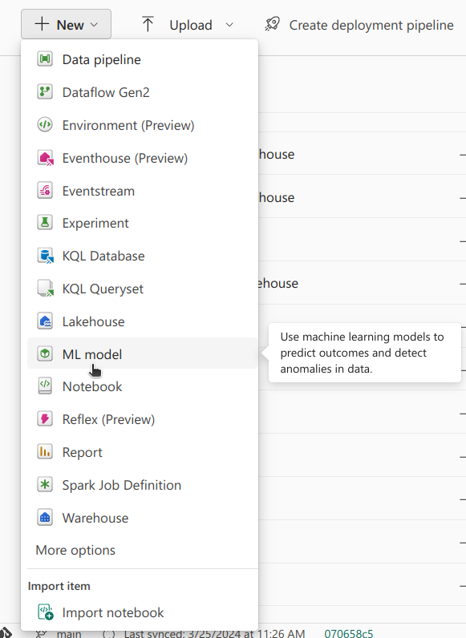
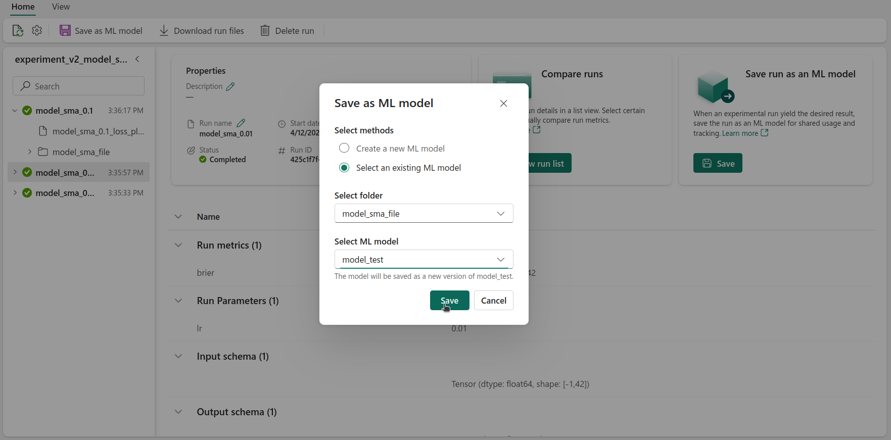

## Introduction

Another very useful tool in Fabric is **ML Model**. This tool is essentially a wrapper for the [MLFlow Model Registry](https://mlflow.org/docs/latest/model-registry.html). It allows us to register models and keep track of different versions and their respective performances.

A Model Registry can be seen as a catalog of ML Models. An ML Model, saved in the registry, can therefore be seen as a catalog entry. Under this catalog entry, there can be multiple versions of it, grouped together. Fundamentally, each version represents a distinct set of model files. These files contain the model's architecture and trained weights, as well as any other files necessary to load it and use it. Each version is essentially a **snapshot** of the ML Model at a specific point in time.

The process of logging and registering models allows us to methodically organise each model's versions, facilitating deployment for inference - this is especially relevant for produation scenarios. The gap between experimental development and deployment is **bridged**, ensuring that models, valuable assets that are time consuming and resource heavy to create, are accessible, versioned, and ready for production use.

## Registering a Model

### Registering a Model using code

In the previous post we looked at creating experiments and logging runs with different configurations. Logging/registering a model can be done using code within a run. To do that, we have to add a couple of lines to a run.

```python
# Start the training job with `start_run()`
with mlflow.start_run(run_name="logging_a_model") as run:
  # Previous code...
  # Train model
  # Log metrics

  # Calculate predictions for training set
  predictions = model.predict(X_train_scaled_df)

  # Create Signature
  # Signature required for model loading later on
  signature = infer_signature(np.array(X_train_scaled_df), predictions)

  # Model File Name
  model_file_name = model_name + "_file"

  # Log model
  mlflow.tensorflow.log_model(best_model, model_file_name, signature=signature)

  # Get model URI
  model_uri = f"runs:/{run.info.run_id}/{model_file_name}"

  # Register Model
  result = mlflow.register_model(model_uri, model_name)
```

Note that a signature is needed, which is essentially the input and output shape of the model, to ensure that the model can be loaded, later on.

MLFlow has functions to log models made with different commonly used packages, such as [TensorFlow](https://www.tensorflow.org/), [PyTorch](https://pytorch.org/), and [scikit-learn](https://scikit-learn.org/). When `mlflow.tensorflow.log_model` is used, a folder is saved, as an artifact, attatched to the run, containing the files needed to load and run the model. In these files, the architecture along with with trained weights of the model and any other configuration necessary for reconstruction are found. This makes it possible to load the model later, either to do inference, fine-tune it, or any other regular model operations without having to re-run the original code that created it.

The model's URI is essentially the "path" to the model file - note that it's made up of the run ID and the name of the file used for the model. Once we have the model's URI, we can register a ML Model, using the model's URI.

In this case, if a ML Model with the `model_name` already exists, a new version is added. If there are two versions already, this will create the third, *i.e.* the latest. If an ML Model with that name doesn't exist, an ML Model is created and the logged model is considered its first version. In the last post, we saw how three experiments were created, one for each model architecture being tested, and, for each model, three different learning rates were tested. For each model architecture, an ML Model was created, and for each learning rate, a version was saved! This mean that each ML Model version is attached to a run, *i.e.* is attached to a Brier score - that is what will allow us to, besides versioning the different models (we know exactly what led to the creation of each version), select the best performing one for our final prediction!

### Registering a Model using the UI

An ML Model can also be registered via Fabric's UI. Model versions of said ML Model can be imported from runs from different experiments. Note how `ML Models` and `Experiments` are often strongly related.



After creating an ML Model, we can import a model from a run to be a version of this ML Model. To do that, in a run, we have select `Save` in the `Save run as an ML Model` section. A pop up box will show up, and we'll have to select the folder that contains the model (this is the logged model, an artifact that was saved in the run), and select the ML Model that this artifact will be saved to. This will create a new version of the ML Model, the latest.



## Selecting Best Model

After that was done, the next step was selecting the best model. This could have been done visually, using the UI, opening each experiment, selecting the `list view`, and selecting all of the available runs. After finding the best run, we would have to check which model and version that would be.


Alternatively, it can also be done via code, by getting all of the versions of all of the ML Models performance, and selecting the version with the best score.

```python
from mlflow.tracking import MlflowClient

client = MlflowClient()

mlmodel_names = list(model_dict.keys())
best_score = 2
metric_name = "brier"
best_model = {"model_name": "", "model_version": -1}

for mlmodel in mlmodel_names:

	model_versions = client.search_model_versions(filter_string=f"name = '{mlmodel}'")

	for version in model_versions:

		# Get metric history for Brier score and run ID
		metric_history = client.get_metric_history(run_id=version.run_id,
		                                           key=metric_name)

		# If score better than best score, save model name and version
		if metric_history:
			last_value = metric_history[-1].value
			if last_value < best_score:
				best_model["model_name"] = mlmodel
				best_model["model_version"] = version.version
				best_score = last_value
		else:
			continue
```

In the previous code snippet, we first get a list of all of the available ML Models. Then, we iterate over this list and get all of the available versions of each ML Model.

Getting a list of the versions of an ML Model can be done using the following line:
```python
model_versions = client.search_model_versions(filter_string=f"name = '{mlmodel}'")
```

Then, for each version, we simply have to get its metric history. That can be done with the following line:
```python
metric_history = client.get_metric_history(run_id=version.run_id,
		                                       key=metric_name)
```

After that, we simply have to keep track of the best performing version. Note how we set the intial Brier score threshold to 2, since the maximum value that a Brier score can be is 1. At the end of this, we had found the best performing model overall, regardless of architecture and hyperparameters.

## Loading the Best Model

After finding the best model, using it to get the final predictions can be be done using the following code snippet:

```python
# Load the best model
loaded_best_model = mlflow.pyfunc.load_model(f"models:/{best_model['model_name']}/{best_model['model_version'].version}")

# Evaluate the best model
final_brier_score = evaluate_model(loaded_best_model, X_test_scaled_df, y_test)
print(f"Best final Brier score: {final_brier_score}")
```

Loading the model can be done using `mlflow.pyfunc.load_model()`, and the only argument that is needed is the model's path. The path of the model is made up of its name and version, in a "models:/[model name]/[version]" format. After that, we just have to make sure that the input is the same shape and the features are in the same order as when it was trained - and that's it! Using the test set, we calculated the final Brier Score, 0.20.

## Conclusion

In this post we discussed the ideas behind a model registry, and why it's beneficial to use one. We showed how Fabric's model registry can be used, through the ML Model tool, either via the UI or code. Finally, we looked at loading a model from the registry, to do inference.
