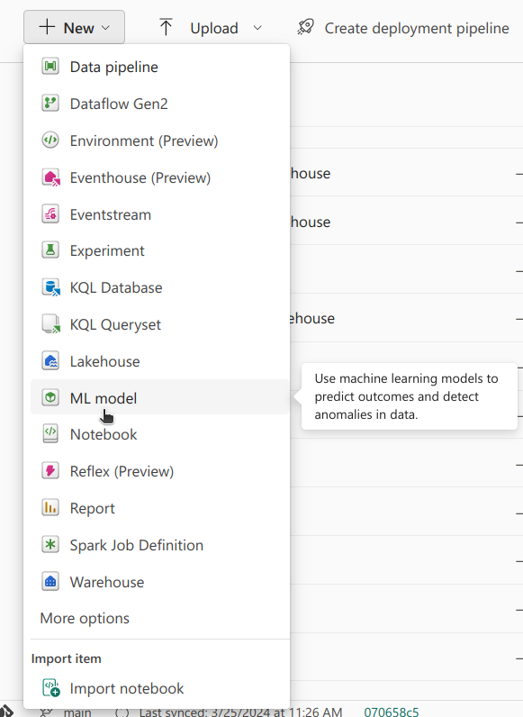
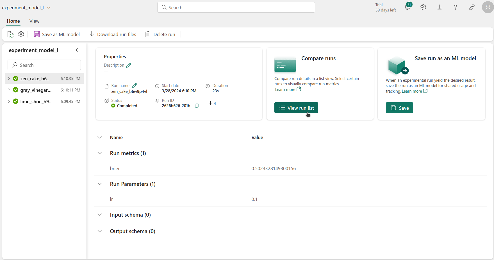

## Introduction

Another very useful tool in Fabric is ML Model. This tool is essentially a wrapper for the MLFlow Model Registry. It allows us to register models and keep track of different versions and their respective performances.

A Model Registry can be seen as a catalog of ML Models. An ML Model, saved in the registry, can therefore be seen as a catalog entry. Under this catalog entry, there can be multiple versions of it, grouped together. Fundamentally, each version represents a distinct set of model files. These files contain the model's architecture and trained weights, as well as any other files necessary to load it and use it. Each version is essentially a **snapshot** of the ML Model at a specific point in time.

The process of logging and registering models allows us to methodically organise each model's versions, facilitating deployment for inference - this is especially relevant for producation scenarios. The gap between experimental development and deployment is bridged, ensuring that models, valuable assets that are time consuming and resource heavy to create, are accessible, versioned, and ready for production use.

## Registering a Model

Registering a model is straightforward - we have to add a couple of lines to a run.

```python
# Start the training job with `start_run()`
with mlflow.start_run(run_name="logging_a_model") as run:
  # Previous code...
  # Train model
  # Log metrics

  # Log model
  predictions = model.predict(X_train_scaled_df)  # will be needed later

  # Signature required for model loading later on
  signature = infer_signature(np.array(X_train_scaled_df), predictions)

  # Model File Name
  model_file_name = model_name + "_file"
  mlflow.tensorflow.log_model(best_model, model_file_name, signature=signature)

  # Get model URI
  model_uri = f"runs:/{run.info.run_id}/{model_file_name}"

  # Register Model
  result = mlflow.register_model(model_uri, model_name)
```

Note that a signature is needed. A signature is essentially the input and output shape of the model. This is needed to later on load the model.

MLFlow has functions to log models made with different commonly used packages, such as tensorflow, pytorch, and sklearn. When `mlflow.tensorflow.log_model` is used, a folder is saved, attatched to the run, containing the files needed to load and run the model. In these files, the architecture along with with trained weights of the model and any other configuration necessary for reconstruction are found. This makes it possible to load the model later, either to do inference, fine-tune it, or any other regular model operation without having to re-run the original code that created it.

The model's URI is essentially the "path" to the model file - note that it's made up of the run ID and the name of the file used for the model. Once we have the model's URI, we can register a ML Model, using the model's URI.

In this case, if a ML Model with the `model_name` already exists, a new version is added. If it doesn't exist, an ML Model is created with that name and the logged model is considered the first version.

An ML Model can also be created via Fabric's UI. Model versions of said ML Model can be imported from runs from several different Experiments.



-> show selecting a model from a run to add to the ML Model

### Registering Different Models at Once 

For this case study, in this series, several runs were executed, testing different values for the learning rate, for different model architectures, and registering a new version of each model along the way.

```python

model_dict = {
    'model_s': create_model_1,  # small
    'model_m': create_model_2,  # medium
    'model_l': create_model_3   # large

}

input_shape = X_train_scaled_df.shape[1]
epochs = 100

for model_name in model_dict:
    
    # create mlflow experiment
    experiment_name = "experiment_" + model_name

    # Check if experiment exists
    # if not, create it
    if not mlflow.get_experiment_by_name(experiment_name):
        mlflow.create_experiment(name=experiment_name)

    # Set experiment
    mlflow.set_experiment(experiment_name)

    learning_rate_list = [0.001, 0.01, 0.1]

    for lr in learning_rate_list:

        with mlflow.start_run() as run:
            # Create model and dataset
            model = model_dict[model_name](input_shape)

            # Train model
            history, best_model = compile_and_train(model,
                                                    X_train_scaled_df, y_train,
                                                    X_validation_scaled_df, y_validation,
                                                    epochs,
                                                    lr)
            
            
            # Calculate score
            brier_score = evaluate_model(best_model, X_test_scaled_df, y_test)

            # Log metrics and hyper-parameters
            mlflow.log_metric("brier", brier_score)

            # Log hyper-param
            mlflow.log_param("lr", lr)

            print("Logging model!")

            # Log model
            predictions = best_model.predict(X_train_scaled_df)

            # Signature required for model loading later on
            signature = infer_signature(np.array(X_train_scaled_df), predictions)
            model_file_name = model_name + "_file"
            mlflow.tensorflow.log_model(best_model, model_file_name, signature=signature)
            
            # Get model URI
            model_uri = f"runs:/{run.info.run_id}/{model_file_name}"
            
            # Register Model
            result = mlflow.register_model(model_uri, model_name)

```

## Selecting Best Model

After that was done, the next step was selecting the best model. This could have been done visually, using the UI, opening each experiment, selecting the List View, and selecting all of the available runs.



Alternatively, it can also be done via code, by getting all of the versions of all of the ML Models performance, and selecting the version with the best score.

```python
from mlflow.tracking import MlflowClient

client = MlflowClient()

mlmodel_names = list(model_dict.keys())
best_score = 2
metric_name = "brier"
best_model = {"model_name": "", "model_version": -1}

for mlmodel in mlmodel_names:

	model_versions = client.search_model_versions(filter_string=f"name = '{mlmodel}'")

	for version in model_versions:

		# Get metric history for Brier score and run ID
		metric_history = client.get_metric_history(run_id=version.run_id,
		                                           key=metric_name)

		# If score better than best score, save model name and version
		if metric_history:
			last_value = metric_history[-1].value
			if last_value < best_score:
				best_model["model_name"] = mlmodel
				best_model["model_version"] = version.version
				best_score = last_value
		else:
			continue
```

## Loading the Best Model

After finding the best model, using it to get the final predictions can be be done using the following code snippet:

```python
loaded_best_model = mlflow.pyfunc.load_model(f"models:/{best_model['model_name']}/{best_model['model_version'].version}")
final_brier_score = evaluate_model(loaded_best_model, X_test_scaled_df, y_test)
print(f"Best final Brier score: {final_brier_score}")
```

## Conclusion

...
