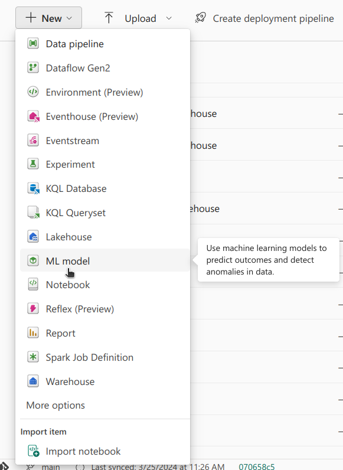

## Introduction

At the time of writing, it's basketball season in the United States, and there is a lot of excitement around the men's and women's college basketball tournaments. The format is single elimination, so over the course of several rounds, teams are eliminated, till eventually we get a champion. This tournament is not only a showcase of upcoming basketball talent, but (more importantly) also a fertile ground for data enthusiasts to analyze trends and predict outcomes.

One of the great things about sports (perhaps the only thing!) is that there is lots of data available, and we at [Noble Dynamic](https://nobledynamic.com/) wanted to take a crack at it :nerd_face:.

We've decided to explore some of the most interesting functionalities offered by [Microsoft Fabric](https://www.microsoft.com/en-us/microsoft-fabric), a recent all-in-one cloud data tool launched by Microsoft, to tackle this challenge.

This is the first part of a series of posts about *Fabric Madness*. 

In this blog post, we'll be going over:
- Data Wrangling using the notebook built-in data wrangler
- Fast Exploratory Data Analysis (EDA) and Feature Engineering with the help of PySpark
- Tracking the performance of different Machine Learning (ML) Models using Experiments
- Selecting the best performing model using the ML Model functionality
- Predicting the winner of this year's tournament

Let's get to the first step, getting and processing data to create a dataset with relevant features.

## The Data

The data used was obtained from the on-going Kaggle competition. That competition can be found [here](https://www.kaggle.com/competitions/march-machine-learning-mania-2024/overview).

Among all of the interesting data available, our focus for this case study was on the match-by-match statistics. This data was available for both the regular seasons and the tournaments, going all the way back to 2003. For each match, besides the date, the teams that were playing, and their scores, other relevant features were made available, such as field goals made and personal fouls by each team.

### Loading the Data

The first step was creating a Fabric workspace. In this workspace is where all of the data and tools would be used.

After downloading all of the CSV files available, a Lakehouse was created. A Lakehouse, in simple terms, is storage for both Tables (structured) and Files (unstructured) data. The data in the created Lakehouse is available for every tool in the workspace.

Uploading the files was done using the UI:


Fig. 1 - Uploading Files.

Now that there was a Lakehouse with the CSV files, it was time to dig in, and get a first look at the data. To do that, a Notebook was created, using the UI, attaching the created lakehouse.


Fig. 2 - Adding Lakehouse to Notebook.


### First Look

After a quick data wrangling, it was found that, as expected with data from Kaggle, the quality was great. With no duplicates or missing values.

To do this, we used [Data Wrangler](https://learn.microsoft.com/en-us/fabric/data-science/data-wrangler), a tool built in to Microsoft Fabric notebooks. Once an initial DataFrame has been created (Spark or pandas supported), Data Wrangler becomes available to use and can attach to any DataFrame in the Notebook. What's great is that it allows for easy analysis of loaded DataFrames. In a Notebook, after reading the files into PySpark DataFrames, in the "Data" section, the "Transform DataFrame in Data Wrangler" was selected,  and from there the several DataFrames were explored. Specific DataFrames can be chosen, carrying out a careful inspection.


Fig. 1 - Opening Data Wrangler


Fig. 2 - Analysing the DataFrame with Data Wrangler


In the center, we have access to all of the rows of the loaded DataFrame. On the right, a **Summary** tab, showing that indeed there are no duplicates or missing values. Clicking in a certain column will, summary statistics of that column will be shown.

On the left, in the **Operations** tab, there are several pre-built operations that can be applied to the DataFrame.

If it were the case that some DataFrames needed cleaning, those steps could also be done using the Data Wrangler, in a low-code format. The desired operation would have to be selected and applied. In this case, the data was already in good shape, so we moved on to EDA.

### EDA

A short EDA followed, with the goal of getting a general idea of the data. Charts were plotted to get a sense of the distribution of the data and if there were any statistics that could be problematic due to, for example, very long tails.


Fig. 3 - Histogram of Fields Goal Made

At a quick glance, it was found that the data available from the regular season had normal distributions, suitable to use in the creation of features. Knowing the importance that good features have in creating solid predictive systems, the next sensible step was to carry out feature engineering to extract relevant information from the data.

The goal was to create a dataset where each sample's input would be a set of features for a game, containing information of both teams. For example, both teams average field goals made for the regular season. The target for each sample, the desired output, would be 1 if Team 1 won the game, or 0 if Team 2 won the game (which was done by subtracting the scores). Here's a representation of the dataset:

| Team1ID | Team2ID | Team1Feat1 | Team2Feat2 | T1Score-T2Score | Target |
|:-------:|:-------:|:----------:|:----------:|:---------------:|:------:|
| 1       | 2       | 0.5        | 0.6        | 8               | 1      |
| 3       | 1       | 0.2        | 0.7        | 12              | 1      |
| 2       | 4       | 0.8        | 0.6        | -3              | 0      |

### Feature Engineering

The first feature that we decided to explore was win rate. How good would the win rate of the regular season be when predicting the winner of matches during the tournament? The "rule" here was that the team with the higher win rate would be predicted as the winner. Not only would it be interesting to explore that feature, but it would also provide a baseline score. At this point, the way to score each predictive system should be introduced. For this case study, the Brier score was used.

The Brier score can be described by the following formula:


\\(\Large Brier Score = \frac{1}{N} \sum_{i=1}^{N} (p_i - o_i)^2 \\)

It is the mean of the square of the difference between the predicted probability (p) and the actual outcome (o) for each sample. It helps quantify the accuracy of predictions, similar to how the Mean Squared Error works. However, this metric is especially useful for binary classification. The predicted probability will vary between 0 and 1, and the actual outcome will either be 0 or 1. Thus the Brier score will always be between 0 and 1. As we want the predicted probability to be as close to the actual outcome as possible, the lower the Brier score, the better, being 0 the perfect score, and 1 the worst.

For this baseline, the previously mentioned dataset structure was followed. Each sample of the dataset was a match, containing information for Team 1 and Team 2, the teams that played in that match - specifically, their win rates for the regular season. The actual outcome was considered 1 if Team 1 won, or 0 if Team 2 won. To simulate a probability, the prediction was a normalised difference between T1's win rate and T2's win rate. For the maximum value of the difference btween the win rates, the prediction would be 1. For the minimum value, the prediction would be 0. The Score Difference as the target will be more useful later on, when more features are available, and more complex models will be used.

```python
# Add the "outcome" column: 1 if T1_Score > T2_Score, else 0
tourney_df = tourney_df.withColumn("outcome", F.when(F.col("T1_Score") > F.col("T2_Score"), 1).otherwise(0))

# Adjust range from [-1, 1] to [0, 1]. If below .5 T1 loses, if above .5 T1 wins. If same win rate, assumed "draw" 
tourney_df = tourney_df.withColumn("probability", (F.col("T1_win_ratio") - F.col("T2_win_ratio") + 1) / 2)
```

After calculating the win rate for each season, for each team, and using it to predict the outcome of games, it was found that this feature alone was not very good, with a Brier score of 0.23. Consider that guessing at random leads to a Brier score of 0.25. Knowing this, it strengthened our idea that complex patterns were at play, and using complex algorithms, such as Machine Learning Models, would be a good approach. We continued then, developing more features.

We went back to the statistics of the regular season. The assumption that the performance of a team throughout the regular season can be predictive of a team's performance during the tournament is plausible. So, using all of the statistics available, such as field goals and personal fouls among 11 other, the mean of those was calculated for each team, in each season. Besides these, other features were created using similar assumptions. For example, another feature that was added was the team's Elo at the end of the regular season, to act as an overall measure of the team's quality.


Fig. 4 - Histogram of the Team's Elos

Having a good set of features ready, the final dataset was done. The final dataset had 42 features! It was a combination of the average of both teams statistics during the regular season, as well as the win rate, and the team's Elos.

It was time to move on to the Models and the Experiments

## Models & Machine Learning Experiments

For the models, we opted for simple Neural Networks (NN). To determine which level of complexity would be best, we created three different NNs, with an increasing number of layers and hyper-parameters.

```python
import tensorflow as tf
from tensorflow.keras.models import Sequential, load_model
from tensorflow.keras.layers import Dense
from tensorflow.keras.callbacks import ModelCheckpoint
from sklearn.metrics import brier_score_loss
from tensorflow.keras.optimizers import Adam

def create_model_1(input_shape):
    model = Sequential([
        Dense(64, activation='relu', input_shape=(input_shape,)),
        Dense(1, activation='sigmoid')
    ])
    return model

def create_model_2(input_shape):
    model = Sequential([
        Dense(64, activation='relu', input_shape=(input_shape,)),
        Dense(64, activation='relu'),
        Dense(1, activation='sigmoid')
    ])
    return model

def create_model_3(input_shape):
    model = Sequential([
        Dense(128, activation='relu', input_shape=(input_shape,)),
        Dense(64, activation='relu'),
        Dense(64, activation='relu'),
        Dense(1, activation='sigmoid')
    ])
    return model
```

The next step was running the experiments!

For that, we used the Experiment tool, in MS Fabric. After loading, normalising, and splitting the data, the goal was to try different hyper-parameters, for each model, to see which set of hyper-parameters would lead to the lowest Brier score for each model. Once that was done, we would be able to compare the best version of each model, and select the winner to get our final prediction for the champion of the tournament!

### What is an Experiment?

In Fabric, an Experiment allows us to group runs, where a run is an execution of a snippet of code. In this case, each run would be a training of a model, with a specific set of hyper-parameters. This set of hyper-parameters, along with the final model score, would be logged, and this information would be available for each run. Once enough runs have been completed, the final model scores can be compared, so that the best version of each model can be selected.

Creating an Experiment in Fabric can be done via the UI or directly from a Notebook. The Experiment is essentially a wrapper for MLFlow Experiments, so if you're familiar with that, this will be very straightforward. A great pro of using Fabric Experiment for experiments is that the setup is very simple, and we don't have to worry about setting up the database where the experiments are stored. Furthermore, since the workspace that the Experiment tool is used in can be shared with others, others can easily collaborate, and participate in experiments, either writing code to run experiments, or analysing the results and so on.

### Creating an Experiment

Using the UI, to create an Experiment simply select Experiment from the **+ New** button, and choose a name.


Fig. 5 - Creating an Experiment using the UI.

Once that is done, to use that Experiment in a Notebook, this command has to be added:
```python
import mlflow

experiment_name = "[name of the experiment goes here]"

# Set the experiment
mlflow.set_experiment(experiment_name)
```

Alternatively, an Experiment can be created from the Notebook, which requires one extra command:
```python
import mlflow

experiment_name = "[name of the experiment goes here]"

# First create the experiment
mlflow.create_experiment(name=experiment_name)

# Then select it
mlflow.set_experiment(experiment_name)
```

Note that, if an Experiment with that name already exists, `create_experiment` will throw an error. In that case you might want to use the following code snippet, where first the existence of an Experiment with a given name is checked, and only if it doesn't exist is it create.

```python
import mlflow

experiment_name = "[name of the experiment goes here]"

# Check if experiment exists
# if not, create it
if not mlflow.get_experiment_by_name(experiment_name):
    mlflow.create_experiment(name=experiment_name)

# Set experiment
mlflow.set_experiment(experiment_name)
```

When we set the experiment, runs will be saved to that experiment. To signal that a code snippet is a run that ought to be saved to the experiment we can use the following code snippet in a Notebook cell:

```python
hyper_params = {"alpha": 0.5, "beta": 1.2}

# Start the training job with `start_run()`
with mlflow.start_run() as run:
	# Create model and dataset
	model = create_model(hyper_params)
	X, y = create_dataset()
	
	# Train model
	model.fit(X, y)

	# Calculate score
	score = lr.score(X, y)

	# Log metrics and hyper-parameters
	print("Log metric.")
	mlflow.log_metric("score", score)

	print("Log params.")
	mlflow.log_param("alpha", hyper_params["alpha"])
	mlflow.log_param("beta", hyper_params["beta"])
		
```

The general workflow is described in the code snippet above. After setting the experiment and starting a run, a model is trained, and its score and hyper-parameters are logged.

Another very useful tool in Fabric that should be introduced now is the ML Model tool. This tool is essentially a wrapper for the MLFlow Model Registry. It allows us to register models and keep track of different versions and their respective performances. For this case study, this was perfect. Each of the three different models were registered under a different name, and each version was saved, along with its score. To do that, a couple of extra lines are needed:


```python
hyper_params = {"alpha": 0.5, "beta": 1.2}

# Start the training job with `start_run()`
with mlflow.start_run() as run:
	... (previous code)
	
	# Log a model
	mlflow.tensorflow.log_model(lr, "my_model_1")
	
	# Get model URI
	model_uri = f"runs:/{run.info.run_id}/my_model_1"
	
	# Select Model Name
	model_name = "Model1"
	
	# Register Model
	result = mlflow.register_model(model_uri, model_name)
```

In this case, if a ML Model with the `model_name` already exists, a new version is added. If it doesn't exist, an ML Model is created with that name and the logged model is considered the first version.

An ML Model can also be created via Fabric's UI. Model versions of said ML Model can be imported from runs from several different Experiments.


Fig. 6 - Creating a ML Model using the UI.

Considering this case study, an Experiment was created for each of the three models. Several runs were executed, testing different values for the learning rate, and registering a new version of each model along the way.


```python

model_dict = {
    'model_s': create_model_1,  # small
    'model_m': create_model_2,  # medium
    'model_l': create_model_3   # large

}

input_shape = X_train_scaled_df.shape[1]
epochs = 100

for model_name in model_dict:
    
    # create mlflow experiment
    experiment_name = "3experiment_" + model_name

    # Check if experiment exists
    # if not, create it
    if not mlflow.get_experiment_by_name(experiment_name):
        mlflow.create_experiment(name=experiment_name)

    # Set experiment
    mlflow.set_experiment(experiment_name)

    learning_rate_list = [0.001, 0.01, 0.1]

    for lr in learning_rate_list:

        with mlflow.start_run() as run:
            # Create model and dataset
            model = model_dict[model_name](input_shape)

            # Train model
            history, best_model = compile_and_train(model,
                                                    X_train_scaled_df, y_train,
                                                    X_validation_scaled_df, y_validation,
                                                    epochs,
                                                    lr)
            
            
            # Calculate score
            brier_score = evaluate_model(best_model, X_test_scaled_df, y_test)

            # Log metrics and hyper-parameters
            mlflow.log_metric("brier", brier_score)

            # Log hyper-param
            mlflow.log_param("lr", lr)

            print("Logging model!")

            # Log model
            predictions = best_model.predict(X_train_scaled_df)

            # Signature required for model loading later on
            signature = infer_signature(np.array(X_train_scaled_df), predictions)
            model_file_name = model_name + "_file"
            mlflow.tensorflow.log_model(best_model, model_file_name, signature=signature)
            
            # Get model URI
            model_uri = f"runs:/{run.info.run_id}/{model_file_name}"
            
            # Register Model
            result = mlflow.register_model(model_uri, model_name)

```

After that was done, the next step was selecting the best model. This could have been done visually, using the UI, opening each experiment, selecting the List View, and selecting all of the available runs.


Fig. 7 - Inspecting Experiment.


Fig. 7 - Comparing different runs.

Alternatively, it can also be done via code, by getting all of the versions of all of the ML Models performance, and selecting the version with the best score.

```python
from mlflow.tracking import MlflowClient

client = MlflowClient()

mlmodel_names = list(model_dict.keys())
best_score = 2
metric_name = "brier"
best_model = {"model_name": "", "model_version": -1}

for mlmodel in mlmodel_names:

	model_versions = client.search_model_versions(filter_string=f"name = '{mlmodel}'")

	for version in model_versions:

		# Get metric history for Brier score and run ID
		metric_history = client.get_metric_history(run_id=version.run_id,
		                                           key=metric_name)

		# If score better than best score, save model name and version
		if metric_history:
			last_value = metric_history[-1].value
			if last_value < best_score:
				best_model["model_name"] = mlmodel
				best_model["model_version"] = version
				best_score = last_value
		else:
			continue
```

After finding the best model, using it to get the final predictions can be be done using the following code snippet:

```python
loaded_best_model = mlflow.pyfunc.load_model(f"models:/{best_model['model_name']}/{best_model['model_version'].version}")
final_brier_score = evaluate_model(loaded_best_model, X_test_scaled_df, y_test)
print(f"Best final Brier score: {final_brier_score}")
```

The final best brier score was 0.19, a slight improvement!

## Conclusion

After loading and analysing data from this year's US major college basketball tournament, experiments were created using Fabric's Experiment tool to compare the performance of different models. Finally, the best performing model was selected to carry out the final prediction.


This is the first part of a series of posts about Microsoft Fabric. Stay tuned for more! :wave: